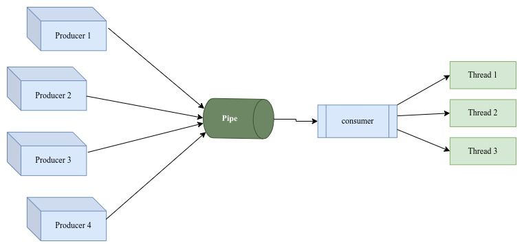

# Piper
This is a PoC on use of pipes for concurrent programming where we have a producer/publisher process and Consumer/Subsriber process.
This implementation runs as process and data is shared through pipes.

## Design

- **Producer** &rarr; This is a system process that pushes complex objects(cannot be pickeled/serialized) into a Pipe.
- **Consumer** &rarr; This is a system process which reads complex objects from a Pipe and distributes the data to a bunch of waiting Threads which process the workload.