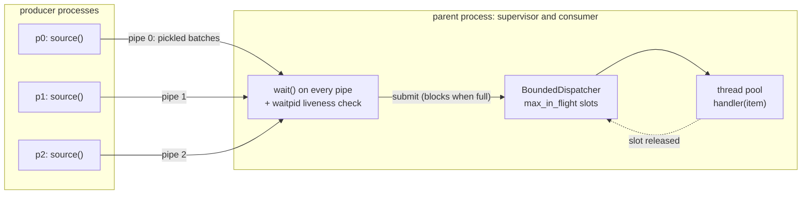

# Piper

How do you fan work out from several producer processes to one consumer that
runs it on a thread pool, over OS pipes, without hanging, leaking processes or
losing track of failures? And what can and cannot cross a process boundary?
Piper answers both. It also measures when crossing that boundary is worth the
cost.

## Concept

**A reader sees EOF only when every copy of the write end is closed.** Copies
multiply: `fork` duplicates every open file descriptor into the child, and
`spawn` and `forkserver` duplicate the ones you pass. A parent that keeps its
own copy of a write end, or a later child that inherits one, holds the pipe
open, and the reader waits forever. That was the first version's hang.

**`multiprocessing.Connection` pickles.** `send(obj)` is `pickle.dumps(obj)`
plus a length-prefixed write, and `recv()` is the reverse. Everything that
crosses must be picklable, by definition. "Send an unpicklable object through a
pipe" is not an option. The real question is which side of the boundary each
object lives on.

| Crosses (pickles) | Does not cross |
|---|---|
| numbers, strings, bytes, lists, dicts, tuples | locks, threads, open files, DB connections |
| `datetime`, `Decimal`, dataclasses of them (JSON can't; pickle can) | lambdas, local functions, generators |
| module-level functions and classes, by reference | anything that holds one of the above |

`tests/test_boundary.py` checks every row. For objects that cannot cross:

- **Send rebuildable state**, such as IDs, primary keys or plain field values,
  and rebuild the object on the other side (for example, re-query it).
- **Keep the object in one process and use threads there.** Piper's handler
  runs in the parent and is never pickled, so it may use anything. Only items
  cross.
- **Share raw buffers** with `multiprocessing.shared_memory`. Bytes are shared
  without copying, but you synchronise access yourself.
- **Django and other DB clients:** a connection must not survive a fork. Call
  `django.db.connections.close_all()` before starting processes and let each
  process open its own.

**One writer per pipe.** If two processes write to the same end, bytes of
different messages can interleave; the `multiprocessing` docs warn the data
"may become corrupted". So each producer gets its own pipe, and the consumer
multiplexes them with `multiprocessing.connection.wait()`, which is `select`
underneath.

**A full pipe is backpressure, if you let it propagate.** When the consumer
stops reading, the pipe buffer (tens of kilobytes; 64 KiB on Linux) fills,
writes block, and the producer stalls. But `ThreadPoolExecutor.submit` never
blocks: its queue is unbounded. A consumer that passes everything to a pool
keeps reading, and memory absorbs the overload instead. Bounding in-flight work restores the
chain: slow workers block the consumer, the pipe fills, and the producer
blocks.

**The start method decides what a child inherits.**

| | spawn | fork | forkserver |
|---|---|---|---|
| Default on | macOS | Linux before 3.14 | Linux since 3.14 |
| The child is | a fresh interpreter | a copy of the parent | a fork of a clean server |
| Producer callable and args | pickled | inherited | pickled |
| Inherits every parent fd | no | yes | no |
| Start-up, 4 producers (measured below) | 240 ms | 4 ms | 42 ms |

Code that works under `fork` can fail under `spawn`, because lambdas and
closures do not pickle. The first version's coroutine variant did exactly that.
Forking a process that already runs threads can also deadlock the child on a
lock some thread was holding. Python 3.12+ warns about it. Piper therefore
starts its thread pool only after the last producer has started.

## Design


```mermaid
flowchart LR
    subgraph producers["producer processes"]
        P0["p0: source()"]
        P1["p1: source()"]
        P2["p2: source()"]
    end
    subgraph parent["parent process: supervisor and consumer"]
        W["wait() on every pipe<br/>+ waitpid liveness check"]
        D["BoundedDispatcher<br/>max_in_flight slots"]
        T["thread pool<br/>handler(item)"]
    end
    P0 -- "pipe 0: pickled batches" --> W
    P1 -- "pipe 1" --> W
    P2 -- "pipe 2" --> W
    W -- "submit (blocks when full)" --> D --> T
    T -. "slot released" .-> D
```

| File | Role |
|---|---|
| `piper.py` | `run_pipeline`, the wire protocol, `BoundedDispatcher` |
| `baseline.py` | `run_in_process`: the same fan-in with no processes; the benchmark's control group |
| `workloads.py` | picklable producers and handlers, including failure injection |
| `demo.py`, `bench.py` | the command-line demo and the benchmark |
| `_cli.py` | entry-point plumbing: signals to exit codes, logging, argument types |

**Wire protocol.** Each message is a tuple: `(BATCH, [items])`, `(DONE,)` or
`(FAILED, traceback)`. The explicit end marker tells a clean finish from a
death. A stream that ends without `DONE` or `FAILED` means the producer
crashed.

**Lifecycle and ownership.** The parent owns every process, pipe and thread.

1. **Start.** For each producer, the parent creates a pipe, starts the process,
   and immediately closes its own copy of the write end, so no later child can
   inherit it. SIGINT and SIGTERM are blocked during this loop. Children
   inherit the mask, so a Ctrl+C during start-up stays pending until the child
   has chosen what to do with it.
2. **Produce.** The child ignores SIGINT (the parent owns shutdown) and resets
   SIGTERM to its default. It closes its copy of the read end: if the parent
   dies, the next send fails with `BrokenPipeError` instead of blocking forever
   on a full pipe. It then streams batches and ends with `DONE`, or `FAILED`
   plus a traceback.
3. **Consume.** The parent `wait()`s on every read end with a 0.5 s timeout.
   Every 0.5 s it also asks the kernel which producers have exited
   (`is_alive()`, which is `waitpid`). EOF alone cannot be trusted, because a
   grandchild may hold the write end. Process sentinels cannot be trusted
   either: under fork and spawn they are pipes too, inherited the same way.
   Testing found this:
   `test_dead_producer_is_detected_while_a_grandchild_holds_its_pipe` waited
   the full 30 s on sentinels.
4. **Dispatch.** Every item goes through `BoundedDispatcher.submit`, which
   blocks while `max_in_flight` items are queued or running.
5. **Finish.** When every stream has ended, the parent waits for running
   handlers, joins the producers (killing any still alive after 5 s), and
   returns a `RunReport`.
6. **Interrupt.** On any exception, including Ctrl+C or SIGTERM (which the CLI
   turns into an exception), the parent stops producers with SIGTERM, cancels
   queued handler work, lets running items finish (threads cannot be killed),
   joins everything and re-raises. The CLI exits 130 or 143.

## Run

```console
$ make run
python3 demo.py
producer  status     items  exit
p0        ok           250  exit code 0
p1        ok           250  exit code 0
p2        ok           250  exit code 0
p3        ok           250  exit code 0
received 1000, processed 1000, handler errors 0 in 0.20 s (spawn, 4 workers, batch 32)
```

Pass flags through `ARGS`. `--inject` breaks producer `p0`, or the handler, in
one of five ways (`raise`, `kill`, `unpicklable`, `undecodable`,
`worker-error`), so each failure mode can be watched. Here p0 is killed after
50 records: one batch of 32 arrived and the 18 still in its unsent batch were
lost.

```console
$ make run ARGS="--inject kill --items 100"
python3 demo.py --inject kill --items 100
2026-10-02 15:33:41,629 ERROR demo: producer p0 crashed: pipe closed without end-of-stream (killed by SIGKILL)
producer  status     items  exit
p0        crashed       32  killed by SIGKILL
p1        ok           100  exit code 0
p2        ok           100  exit code 0
p3        ok           100  exit code 0
received 332, processed 332, handler errors 0 in 0.11 s (spawn, 4 workers, batch 32)
```

Results go to stdout, diagnostics to stderr. Exit codes: 0 when every record
was handled, 1 when anything failed, 2 for bad arguments, 130 after Ctrl+C, 143
after SIGTERM. `python3 demo.py --help` lists every flag. For a run long enough
to interrupt, try `make run ARGS="--items 100000 --produce-ms 1"` and press
Ctrl+C.

| Make target | What it does |
|---|---|
| `run` | runs `demo.py` with `ARGS`; finishes on its own |
| `test` | runs the unittest suite |
| `lint` | `ruff check`, `ruff format --check` and `mypy --strict` |
| `check` | `lint`, then `test`: the gate |
| `bench` | runs `bench.py` with `ARGS` |
| `clean` | removes caches |

| Make variable | Default | Purpose |
|---|---|---|
| `PYTHON` | `python3` | interpreter for every target |
| `UVX` | `uvx` | runs the pinned linters without installing them |
| `RUFF` | `$(UVX) ruff@0.16.10` | linter and formatter |
| `MYPY` | `$(UVX) mypy@2.4.0` | type checker |
| `ARGS` | empty | extra flags for `demo.py` (`make run`) or `bench.py` (`make bench`) |

## Test

```console
$ make check
uvx ruff@0.16.10 check .
All checks passed!
uvx ruff@0.16.10 format --check .
14 files already formatted
uvx mypy@2.4.0 --strict .
Success: no issues found in 13 source files
python3 -m unittest discover -s tests -v
...
----------------------------------------------------------------------
Ran 64 tests in 13.876s

OK
```

Standard library `unittest` only; the suite takes 7 to 15 seconds.

- `test_pipeline.py` runs the whole contract under **spawn, fork and
  forkserver**: exactly-once delivery, termination, zero producers or items,
  every failure mode below, backpressure, and SIGINT cancellation.
- `test_cli.py` drives `demo.py` as a real process tree. It checks exit codes,
  stdout versus stderr, and that Ctrl+C (to the whole process group, like a
  terminal), SIGTERM and SIGKILL of the parent leave no process behind.
- `test_dispatcher.py`, `test_baseline.py` and `test_boundary.py` cover the
  pieces.

Every test runs under a watchdog that dumps all stacks and fails the run
instead of hanging. Warnings are errors, which catches forking with live
threads. SIGINT is reset to Python's handler first: a shell starts background
jobs with SIGINT ignored, every child would inherit that, and signal tests
would test nothing.

## Is crossing a process boundary worth it?

`make bench` times the same workloads through `run_in_process` (one process,
items passed by reference) and `run_pipeline` (pipes). Each run is timed end to
end, from the call until the last item has been handled, process start-up
included. A run counts only if it processed exactly the expected items. Nothing
is printed while timing. Each case runs 5 times; the table reports the median
with the minimum and maximum. There are three workloads:

- **startup**: no items, so only the fixed cost shows.
- **transport**: producing an item costs nothing, so only overhead shows.
- **cpu**: each item costs 4,000 steps of pure-Python arithmetic, which holds
  the GIL. Only separate processes can run that in parallel.

Measured with Python 3.14.7 (CPython, GIL enabled) on macOS 26.6 arm64, 8 CPUs.
The configuration was 4 producers and 4 worker threads with a no-op handler;
transport runs 10,000 items per producer and cpu runs 500.

| workload | mode | spawn (median s) | fork (median s) | forkserver (median s) |
|---|---|---:|---:|---:|
| startup | in-process | 0.000 | 0.000 | 0.000 |
| startup | pipes | 0.240 | 0.004 | 0.042 |
| transport | in-process | 0.264 | 0.260 | 0.276 |
| transport | pipes, batch 1 | 0.864 | 0.808 | 0.926 |
| transport | pipes, batch 64 | 0.377 | 0.286 | 0.358 |
| cpu | in-process | 0.571 | 0.545 | 0.558 |
| cpu | pipes, batch 64 | 0.210 | 0.150 | 0.144 |

Reproduce with `make bench`, `make bench ARGS="--start-method fork"` and
`make bench ARGS="--start-method forkserver"`. The full output includes
min/max and items per second.

What the numbers say:

- **IPC is a per-message cost.** With one item per message, pipes are about
  3x slower than handing items over in-process. With 64 items per message,
  the overhead falls to 10% (fork) to 43% (spawn) of the in-process time.
- **Start-up dominates short runs.** spawn needs about 240 ms to boot four
  fresh interpreters and import their modules; fork needs 4 ms. Under a second
  of work, that alone can decide the question.
- **Processes win when producing is CPU-bound.** With 4 producers the cpu
  workload ran 2.7x faster under spawn and 3.6x under fork than in one process.
  In one process the GIL lets only one thread compute at a time.
- **So:** use processes for CPU-bound work in the producers, batch your
  messages, and keep runs long enough to amortise start-up. For I/O-bound or
  trivial production, one process with threads is simpler and at least as
  fast.

## Failure modes

| Failure mode | What happens | How it's handled | Test |
|---|---|---|---|
| Producer raises | It stops; earlier items were produced | Flushes its partial batch, sends `FAILED` with the traceback, exits 1; the others carry on | `test_raising_producer_is_reported_and_others_finish` |
| Producer killed (SIGKILL, segfault) | Its pipe closes with no end marker | Reported `crashed` with the signal; only its unsent batch is lost | `test_killed_producer_is_reported_as_crashed_not_waited_on`, `test_crash_loses_only_the_unsent_batch` |
| Producer dies while a grandchild holds its pipe | EOF and the sentinel never arrive | `waitpid` liveness check every 0.5 s | `test_dead_producer_is_detected_while_a_grandchild_holds_its_pipe` |
| Unpicklable item (lock, lambda, generator) | `send` fails in the producer | Items before it are delivered, then `FAILED` with `UnpicklableItemError` naming the type | `test_unpicklable_item_fails_producer_after_earlier_items` |
| Item pickles but will not unpickle | `recv` fails in the parent | That producer is terminated and reported `failed`; others carry on | `test_undecodable_item_fails_its_producer_only` |
| Unpicklable producer under spawn or forkserver | `Process.start` cannot pickle it | `ProducerStartError` with a fix-it hint; producers already started are reaped | `test_unpicklable_source_fails_fast_unless_forking` |
| Handler raises | That item fails | Counted, the first 10 errors kept, run reported not ok; never silently dropped | `test_handler_exceptions_are_counted_not_dropped` |
| Handlers slower than producers | Work piles up | Bounded in-flight work, then a full pipe, blocks producers | `test_busy_workers_block_producers_through_the_pipe`, `test_in_flight_work_never_exceeds_the_bound` |
| Ctrl+C (SIGINT to the whole group) | Every process gets SIGINT | Children ignore it; the parent terminates them, drops queued work, exits 130 | `test_sigint_stops_producers_and_drops_queued_work`, `test_producers_ignore_sigint_so_the_parent_owns_shutdown`, `test_signals_shut_down_cleanly_and_leave_no_processes` |
| SIGTERM to the parent | Python would exit without cleanup | The CLI turns it into an exception; same cleanup; exits 143 | `test_signals_shut_down_cleanly_and_leave_no_processes` |
| Parent SIGKILLed | No cleanup can run | Producers hold no read end, so their next send fails and they exit | `test_producers_exit_on_their_own_if_the_parent_is_killed` |
| Ctrl+C during start-up | A half-started child could die mid-bootstrap | Signals are blocked on the starting thread; children inherit that mask and decide before unblocking | `test_signals_during_start_up_are_deferred_not_lost` |
| Zero producers, zero items | Nothing to do | Returns an empty, ok report | `test_zero_producers`, `test_producers_with_zero_items` |
| Bad flags (negative, zero, NaN, unknown) | Would misbehave later | Rejected at parse time, exit 2 | `test_invalid_arguments_exit_two`, `test_rejects_invalid_options_before_starting_anything` |
| A test hangs | The suite would stall | Watchdog dumps stacks and fails the run | Every test, via `WatchdogTestCase` |

## What the first version got wrong

1. **The premise.** The README promised to push "complex objects (cannot be
   pickled/serialized) into a Pipe". A pipe pickles everything it carries, so
   that is impossible. The lesson: decide which side of the boundary an object
   lives on, and send only what pickles.
2. **The coroutine variant never crossed a process boundary.** It passed a
   primed generator to `Process`. Under spawn, the macOS default, that fails,
   because generators do not pickle. Under fork it "worked" because the child
   got a *copy* of the consumer. The parent's consumer received 0 items, and
   all the work ran inside the producer process. Its claim of "200% faster"
   compared function calls with real IPC. The honest version is
   `baseline.py`, labelled as not IPC, and `make bench` answers the question
   it was really asking.
3. **The test object proved nothing.** `Complex` held a `datetime`, with a
   comment saying it "can't serialize". That is true of JSON but not of
   pickle, so it crossed the pipe fine and never exercised the claim.
4. **It hung on exit.** The consumer's `writer.close()` was commented out and
   the parent held both ends, so `recv()` never saw EOF. `Process(...).start()`
   returns `None`, so nothing could join or stop the consumer. Because it was
   not a daemon, the interpreter waited for it forever. The last line of the
   committed `benchmark.txt`, "Exiting this pool", came from the Ctrl+C
   handler.
5. **Concurrent writers, in theory.** `no_of_publishers` sized a `Pool`, but
   only one `apply_async` ever ran. Had more run, they would have shared one
   `Connection` end and could have corrupted each other's messages.
6. **Unbounded buffering.** `ThreadPoolExecutor.submit` never blocks, so the
   consumer would drain the pipe into memory as fast as it could read.
7. **Dropped errors.** Futures were never inspected, so handler exceptions
   vanished.
8. **The benchmark measured the terminal.** It printed every item while
   timing, timed only the sending side, and ran once. Its coroutine leg could
   not run at all (`main()` took no arguments, and `time.now()` does not
   exist). It also did less work than the pipes leg, because unconfigured
   logging discarded its messages.
9. **Supervision that never stopped.** The manager restarted the producer
   every 5 s, even after it had finished successfully, so a finite job ran
   forever.

## Trade-offs and limits

- **Crashes lose work.** A killed producer loses its unsent batch (up to
  `batch_size - 1` items). On interrupt, queued handler work is dropped.
  Nothing is retried or persisted. For durability, use a broker with
  acknowledgements, as the RabbitMQ prototype in this repo does.
- **No restarts.** A failed producer stays failed. Restarting is easy to get
  wrong: the first version restarted finished producers. If you need it,
  restart only crashes, cap the attempts, back off, and make producers
  resumable. Otherwise every restart duplicates items.
- **The single consumer is the ceiling.** Dispatch costs about 6.5 µs per item,
  roughly 150,000 items/s here. For tiny items, give the handler whole batches.
- **Handlers share one GIL.** CPU-heavy handling will not parallelise on
  threads. Move CPU work into the producers, as the cpu benchmark does, or
  hand it to a process pool, which brings pickling back.
- **A hung handler blocks exit.** Threads cannot be killed, and the
  interpreter joins pool threads at exit.
- **Small blind spots.** A death hidden by a leaked write end is detected
  within 0.5 s, not instantly. A producer killed mid-message while another
  process holds its write end would block `recv()`; that case is not handled.
  In a parent that already runs other threads, one of them may take a
  process-wide Ctrl+C during start-up; children stay protected and cleanup
  still runs, but the parent sees the signal early.
- **Daemonic producers.** They cannot start child processes of their own.
- **Not covered.** This is POSIX only: signal masks, SIGTERM and fork have no
  Windows equivalent. Free-threaded (no-GIL) Python builds are untested; there
  the in-process cpu case could scale on threads and change the conclusion.
