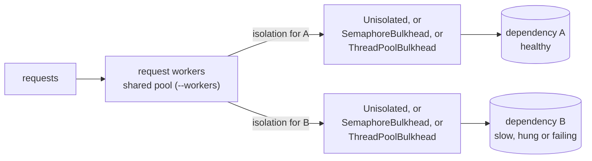

# Bulkhead

How do I stop one slow or failing dependency from exhausting shared resources
and taking everything else down, and how do bulkheads combine with timeouts and
fail-fast rejection? This prototype runs the same load through a service three
ways (no isolation, a semaphore bulkhead per dependency, a thread-pool bulkhead
per dependency) while one dependency hangs, and measures what happens to the
healthy one.

## Concept

**Slowness, not failure, is what exhausts a service.** A dependency that fails
fast costs its callers almost nothing: the error comes back and the thread moves
on. A dependency that answers slowly, or never, holds a caller's thread for the
whole wait. Little's law gives the size of the problem: *calls in flight =
arrival rate × latency*. At 100 requests per second, a dependency answering in
5 ms occupies 0.5 threads; at 1 s it needs 100, and a service with 16 request
workers has nothing left for anything else. The benchmark below shows both: a
dependency that fails fast leaves its neighbour untouched, while a slow or hung
one starves it.

**A bulkhead partitions a shared resource** so that one flooded compartment
cannot sink the ship. Each dependency gets a fixed share of concurrency, and a
call beyond that share is refused at once instead of queueing for a thread the
service cannot spare. Michael Nygard's *Release It!* (2nd ed., 2018, "Stability
Patterns") describes the pattern alongside the ones it works with: Timeouts,
Fail Fast, Shed Load and Circuit Breaker.

**There are two ways to build one**, and Netflix Hystrix named them (Hystrix is
retired; resilience4j ships both as `SemaphoreBulkhead` and
`ThreadPoolBulkhead`):

- **Semaphore isolation.** A counter limits how many callers may be inside the
  dependency at once. The call runs on the caller's own thread, so it is cheap,
  with no hand-off. But a caller that gets in is stuck for as long as the call
  takes. The bulkhead cannot rescue it; it can only stop more callers from
  joining it.
- **Thread-pool isolation.** Each dependency gets its own small pool. The
  caller hands the call over and waits at most a timeout, so it always gets its
  thread back on time. The cost is a thread hand-off per call, and a hung call
  still holds its pool worker until it returns: Python cannot kill a thread, and
  Java cannot safely either. Once a hung dependency holds every worker, the
  bulkhead rejects every call. It fails fast instead of letting the hang spread.

**Timeouts are still required.** A bulkhead bounds *how many* calls a
dependency can hold; a timeout bounds *how long*. The thread-pool bulkhead's
timeout frees the caller, not the call. Only the client's own I/O timeout (a
socket timeout, a request deadline) actually ends a call and frees its worker
and connection. Without one, a hung dependency keeps its share of the bulkhead
forever, as the demo's "pool workers stuck" column shows. See the AWS Builders'
Library, [Timeouts, retries and backoff with
jitter](https://aws.amazon.com/builders-library/timeouts-retries-and-backoff-with-jitter/).

**Rejection is load shedding at a dependency boundary.** A refused call should
answer quickly, with an error or a fallback (a cached value, a degraded page),
and must not be retried at once, because a retry adds load to the thing that is
already overloaded. See [Using load shedding to avoid
overload](https://aws.amazon.com/builders-library/using-load-shedding-to-avoid-overload/).

**Circuit breakers complement bulkheads.** A breaker stops calling a dependency
that keeps failing or timing out, and probes for its recovery. The bulkhead caps
the damage while the breaker decides. This prototype does not implement a
breaker.

**Sizing follows from Little's law too.** A bulkhead of `N` slots supports
about `N / latency` calls per second to that dependency. Size it for the
dependency's healthy p99 latency at peak load, with headroom: too small and it
rejects healthy traffic; too large and it stops protecting anything.

**The same idea applies to messaging.** Separate queues or consumer groups per
workload, each with a cap on unacknowledged messages, are bulkheads for
consumers. The NATS prototype in this repo uses a per-consumer `MaxAckPending`
for exactly that. The transport is irrelevant to the pattern, which is why this
prototype needs no messaging library.

## Design



| File | Role |
|---|---|
| `bulkhead.py` | `Unisolated`, `SemaphoreBulkhead` and `ThreadPoolBulkhead` behind one `Isolation` protocol, with `BulkheadFullError`, `CallTimeoutError` and observable counters (`stats()`, `wait_until()`). |
| `service.py` | `Dependency`, a simulated downstream whose mode (healthy, slow, hung, failing) changes at runtime, and `Service`, which runs requests on a shared worker pool and calls each dependency through the isolation its `Variant` prescribes. |
| `main.py` | The demo: one hung dependency, every variant, one table. |
| `bench.py` | The benchmark: a fixed request rate while B degrades, per variant. |
| `_cli.py` | Exit codes, signal handling, logging and flag validation shared by the entry points. |

**How a hang is simulated.** `Dependency.hang()` makes every call block on an
event that only `release()` or `shutdown()` sets. A test can therefore hold a
hang for exactly as long as it likes and then end it, with no sleeps or timing
involved. Every claim in the tests is proven this way, by structure: counters,
events and the bulkheads' own `wait_until()`.

**Ownership and shutdown.**

- A `Service` owns its request workers and its isolations. A
  `ThreadPoolBulkhead` owns its pool.
- A `Dependency` belongs to whoever created it: the demo, the benchmark or a
  test.

Shutdown runs in a fixed order:
1. End the hang. In the simulation, `Dependency.shutdown()` does this. In
   production only the client's I/O timeout can.
2. `Service.close()` cancels queued requests and joins the request workers.
3. Closing each isolation joins its pool workers.

`close()` before step 1 would wait on the stuck threads, so the order matters,
and it is the same lesson as the timeouts above.

**Signals.** `_cli.run_main` installs explicit SIGINT and SIGTERM handlers. A
process started with `&` from a script inherits SIGINT as ignored, and Python
would keep ignoring it. The first signal writes a notice to stderr and raises
`Interrupted` in the main thread. The `finally` blocks then run the shutdown
order above, and the program exits with 128 + the signal number. A second
signal exits at once.

## Run

```console
$ make run
python3 main.py
B hangs. The service sends 8 requests to B, then 4 to A, and waits 500 ms.
4 request workers; bulkhead capacity 2 per dependency; thread-pool timeout 100 ms.

variant      A answered   B rejected  B timed out  request workers stuck  pool workers stuck
shared       0 of 4       0           0            4 of 4                 0
semaphore    4 of 4       6           0            2 of 4                 0
thread-pool  4 of 4       6           2            0 of 4                 2

After B was released, every variant shut down and joined all of its threads.
```

Reading the table:

- **shared:** B's hung calls hold every request worker, so A is never served.
- **semaphore:** B may hold only 2 workers. Its other 6 requests are rejected
  at once, and A is served. The 2 workers inside B stay stuck until B answers.
- **thread-pool:** B's calls run on B's own 2 threads. Their callers give up
  after 100 ms and get their workers back, so no request worker is stuck. B's
  2 threads stay stuck, and while they are, every new call to B is rejected.

| Make target | What it does |
|---|---|
| `make run` | The demo above. Exits 0, or 1 if any variant leaked a thread. |
| `make test` | The unit and process tests. |
| `make lint` | `ruff check`, `ruff format --check`, `mypy --strict`. |
| `make check` | `lint`, then `test`. |
| `make bench` | The benchmark (about 20 s with defaults). |
| `make clean` | Removes caches. |

| Make variable | Default | Meaning |
|---|---|---|
| `ARGS` | empty | Extra flags for `run` or `bench`, e.g. `make run ARGS="--limit 3"` or `make bench ARGS="--b-mode slow"`. |
| `PYTHON` | `python3` | Interpreter for the demo, benchmark and tests. |
| `RUFF` | `uvx ruff@0.16.10` | Pinned linter and formatter. |
| `MYPY` | `uvx mypy@2.4.0` | Pinned type checker. |

`python3 main.py --help` and `python3 bench.py --help` list every flag with its
default and range.

| Exit status | Meaning |
|---|---|
| 0 | Finished |
| 1 | The demo found a thread still alive after shutdown |
| 2 | Bad flag or value (argparse) |
| 130 | Shut down cleanly after SIGINT |
| 143 | Shut down cleanly after SIGTERM |

## Test

```console
$ make check
uvx ruff@0.16.10 check .
All checks passed!
uvx ruff@0.16.10 format --check .
10 files already formatted
uvx mypy@2.4.0 --strict .
Success: no issues found in 9 source files
python3 -m unittest discover -s tests -v
...
Ran 39 tests in 6.0s

OK
```

The suite needs no network or external services. It passed five runs in a row
and a sixth with every CPU saturated.

Before the tests were trusted, eight bugs were reintroduced into a scratch
copy, one at a time, and each made the suite fail cleanly, without hanging (see
the mutation list at the end of this README).

## Benchmark

`make bench` drives 200 requests per second for 1 s, half to A (5 ms
latency) and half to B, while B degrades. A request "answers in time" if it
returns OK within a 500 ms client deadline counted from when it was sent, so
waiting for a request worker counts against it. Each variant runs 5 times
with seeds 1 to 5; cells show the median and, where the runs differ, the
min-max range. Latency percentiles are nearest-rank and cover only in-time
answers.

Machine: Apple M3, 8 cores, macOS 26.6.2, Python 3.14.7. The load average was
about 43 during these runs, because other work was running; the results
matched an earlier full run to the percentage point.

**B hung** (`make bench`):

| variant | A answered in time | A p50 | A p99 | B rejected | B timed out | B no answer |
|---|---:|---:|---:|---:|---:|---:|
| shared | 17% (13%-26%) | 7.2 ms | 10.1 ms | 0% | 0% | 100% |
| semaphore | 100% | 6.9 ms | 10.4 ms | 96% | 0% | 4% |
| thread-pool | 100% | 7.4 ms | 10.7 ms | 96% | 4% | 0% |

**B slow, 1 s per call** (`make bench ARGS="--b-mode slow"`): the same
picture. Shared 17% (13%-26%), semaphore and thread-pool 100%.

**B failing fast** (`make bench ARGS="--b-mode failing"`): A answered 100% in
time under every variant, including shared. A dependency that fails fast holds
nothing.

How to read it:

- **Shared:** A gets 17% of its answers in time: only the requests that
  arrived before B's calls had taken all 16 workers. A's latency percentiles
  look healthy only because they cover that 17%. Everyone else waited past the
  deadline.
- **Semaphore:** B holds 4 workers (its "no answer" 4% are the admitted calls,
  stuck), and its other calls are rejected in microseconds. A never notices.
- **Thread-pool:** the same, except B's 4 admitted calls end for their callers
  as a 100 ms timeout instead of no answer, and no request worker is stuck.
- A's p99 rises by a few milliseconds with either bulkhead: the cost of the
  rejections and, for the pool, of a thread hand-off per call.

Every number comes from `make bench` and its flags (`python3 bench.py --help`
lists them); `--quick` is a 0.5 s smoke run that the tests exercise.

## Failure modes

| Failure mode | What happens | How it's handled | Test |
|---|---|---|---|
| B hangs, no bulkhead | B's calls hold every request worker; A starves | Nothing: this is the anti-pattern being demonstrated | `test_shared_pool_starves_healthy_dependency_when_one_hangs` |
| B turns slow under load | Same as a hang once rate × latency exceeds the pool (Little's law) | Bulkheads cap B's share | `test_shared_pool_starves_healthy_dependency_when_one_hangs` (slow subtest), `make bench ARGS="--b-mode slow"` |
| B hangs, semaphore bulkhead | At most `limit` callers stuck in B; the rest rejected at once; A served | `BulkheadFullError` | `test_semaphore_bulkhead_keeps_healthy_dependency_available` |
| B hangs, thread-pool bulkhead | Callers time out and get their workers back; B's pool workers stay stuck, then every call to B is rejected | `CallTimeoutError`, then `BulkheadFullError` | `test_thread_pool_bulkhead_keeps_healthy_dependency_available`, `test_timeout_frees_the_caller_but_the_worker_stays_stuck` |
| More concurrent calls than capacity | Exactly `limit` (or `workers + queue_size`) admitted | `BoundedSemaphore` slots or permits | `test_rejects_exactly_at_capacity`, `test_bound_holds_under_contention`, `test_rejects_when_workers_and_queue_are_full` |
| Bounded wait for a slot | Admitted if a slot frees in time, rejected otherwise | `acquire(timeout=max_wait)` | `test_bounded_wait_admits_a_caller_once_a_slot_frees`, `test_bounded_wait_rejects_when_no_slot_frees` |
| Caller times out while its call is still queued | The call is cancelled and never runs | `Future.cancel()` | `test_timed_out_queued_call_is_cancelled_and_never_runs` |
| The dependency raises `TimeoutError` itself (a socket timeout) | Reported as the dependency's error, not as a bulkhead timeout | `future.done()` check after the wait | `test_timeout_raised_by_the_call_itself_is_not_a_bulkhead_timeout` |
| The dependency raises | The slot or permit is returned | `finally` / done callback | `test_a_failing_call_gives_its_slot_back`, `test_a_failing_call_gives_its_permit_back` |
| B fails fast | Nothing is held, so nothing starves, with or without bulkheads | Not needed | `test_fast_failures_do_not_exhaust_the_shared_pool` |
| Shutdown while a call is hung | `close()` would wait for the stuck threads | End the hang first (I/O timeout in production) | `test_no_threads_leak_once_the_hang_ends_and_the_service_closes` |
| Thread leak | Threads outlive the service | Every pool is joined; the demo checks and exits 1 on a leak | `test_close_joins_every_pool_thread`, `test_no_threads_leak_once_the_hang_ends_and_the_service_closes`, `test_scenario_numbers_match_the_isolation_model` |
| A hang ends and a new one starts | Calls from the first hang are not caught by the second | A fresh gate per hang | `test_a_new_hang_does_not_re_block_calls_from_an_earlier_one` |
| SIGINT or SIGTERM mid-run | Clean shutdown, exit 130 or 143, no process left | `run_main`, `finally` blocks | `test_signals_shut_down_cleanly_with_128_plus_signal` |
| SIGINT inherited as ignored | Ctrl+C still works | Handlers installed explicitly | `test_sigint_works_even_when_inherited_as_ignored` |
| Cleanup hangs after the first signal | The second signal exits at once, without claiming a clean shutdown | `os._exit(128 + n)` | `test_second_signal_forces_exit_when_cleanup_hangs` |
| Bad flags or configuration | Exit 2, or `ValueError` listing every problem | argparse validators, `validate()` | `test_invalid_flags_exit_2`, `test_rejects_nan_and_out_of_range_values`, `test_config_reports_every_problem_at_once`, `test_rejects_invalid_configuration` |

## What the first version got wrong

The `bulkhead` branch held a two-line `bulkhead/main.py`: `import zmq` and
nothing else.

1. **No implementation.** There was no question, no design and no code: only a
   tool.
2. **It could not run.** `python3 main.py` fails with `ModuleNotFoundError: No
   module named 'zmq'`, because pyzmq was never declared anywhere.
3. **The tool was the wrong place to start.** A bulkhead partitions resources
   inside the caller: threads, connections, in-flight messages. It is
   independent of transport, and ZeroMQ adds nothing to the lesson. The same
   branch's NATS consumers, two queue groups each with its own workers, were in
   fact a messaging-level bulkhead. That work continues in the NATS prototype.

*Lesson:* write down the question and the failure mode first; the tool follows
from them, and often isn't needed.

## When to use what

| Isolation | Use it when | Watch out for |
|---|---|---|
| Semaphore bulkhead | Calls are cheap and already have I/O timeouts; you want no hand-off cost | It cannot free a caller stuck in a call |
| Thread-pool bulkhead | You must guarantee callers get their threads back on time | A thread per slot, a hand-off per call, and stuck workers until the call returns |
| `asyncio.Semaphore` plus `asyncio.timeout` | The service is async | Cancellation stops the call at its next `await`, if the client library honours it, which threads cannot do |
| Separate processes, containers or cells | A dependency's failures could crash or exhaust memory, not just threads | Cost and operational weight (see AWS's work on cell-based architecture and shuffle sharding) |
| Queues or consumer groups per workload | Work arrives as messages | A cap on unacknowledged messages per consumer (`MaxAckPending`, prefetch) is the bulkhead |

## Trade-offs and limits

- **The dependencies are simulated in-process.** Real clients add more shared
  resources to partition: connection pools above all. A shared HTTP connection
  pool is itself a resource one slow host can exhaust.
- **The thread-pool bulkhead leaks threads while a call is hung.** The leak is
  bounded by its size, but the threads are only reclaimed when the call
  returns. That is why the I/O timeout matters.
- **No circuit breaker, retries or adaptive limits.** Adaptive concurrency
  limits, such as Netflix's TCP-Vegas-style `concurrency-limits`, size the
  bulkhead from observed latency instead of a constant. They are the natural
  next step.
- **The benchmark is a model.** The worker counts, rates and latencies were
  chosen to make the effect visible; real numbers depend on the workload. The
  GIL plays no part, because blocked threads release it.

Mutation check (not committed), with each bug put back on its own:
- **Caught by a failing test:**
  - a semaphore that never rejects;
  - a semaphore that leaks its slot;
  - a pool with no permits (unbounded);
  - a dependency's own `TimeoutError` misreported as a bulkhead timeout;
  - a queued call not cancelled on timeout;
  - the shared variant secretly given a bulkhead;
  - the SIGINT handler not installed;
  - no second-signal escape.
- **Equivalent:** reusing one hang gate instead of a fresh one is equivalent in
  every observable case except a narrow interleaving that can't be scheduled
  deterministically. The fresh gate stays because it removes that window
  without a test.
