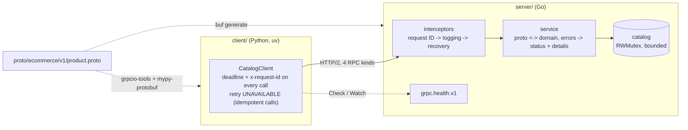

# g_to_RPC

How do I build a gRPC service in Go and call it from Python, and what does "production-ready"
actually require? This prototype is a product catalog. Its Go server and typed Python client
cover all four RPC kinds (unary, server streaming, client streaming, bidirectional). It also
covers end-to-end deadlines and cancellation, structured error details, request-ID metadata,
interceptors, the standard health service, resource limits, keepalive policy, idempotent retries
and graceful shutdown. Each of these is proven by a test.

This branch supersedes PR #16 (`grpc-up-and-running`). That PR claimed a "production ready gRPC
example covering all concepts of RPC" but had two unary RPCs and a data race. The original code
is preserved, with its authorship, in this branch's first commit.

## Concept

**A gRPC service is a contract written in protobuf.** `proto/ecommerce/v1/product.proto` is the
single source of truth. Code generators turn it into Go server interfaces and Python client
stubs, so the two sides cannot disagree about message shapes. The package is versioned
(`ecommerce.v1`), so a breaking change becomes `v2` alongside `v1`, not an edit that breaks
deployed clients. `buf lint` with the STANDARD rules enforces Google's proto style guide:
PascalCase RPC names and a unique `<Rpc>Request`/`<Rpc>Response` message per RPC.

**The four communication patterns** differ in who streams:

| Pattern | RPC here | Shape | Use it when |
|---|---|---|---|
| Unary | `AddProduct`, `GetProduct` | one request, one response | ordinary calls |
| Server streaming | `SearchProducts` | one request, many responses | results arrive over time or are large |
| Client streaming | `BulkAddProducts` | many requests, one response | uploading a batch; here it is applied atomically |
| Bidirectional | `QuoteProducts` | both sides stream independently | conversational exchanges; each quote is answered as it arrives |

**Deadlines, not timeouts.** A gRPC client sets a deadline, an absolute point in time. It travels
to the server in the `grpc-timeout` header and becomes the server handler's `context` deadline,
so the server stops working on a request the client has given up on. An RPC without a deadline
can wait forever, so this client never makes one. Two facts surprised us, and are tested:

- **Deadlines have millisecond resolution in gRPC's C core**, which Python uses. A 1 µs deadline
  is rounded up to about 1 ms, and a loopback RPC finishes well inside that. The first version
  of the demo assumed otherwise, and its own check caught it.
- **A client can see CANCELLED for an RPC that died of its deadline.** When the server's copy of
  the deadline fires first, gRPC-Go resets the stream with `RST_STREAM(CANCEL)`. That can arrive
  before the client's own timer, which C core rounds up, fires. The client therefore treats
  CANCELLED after its own deadline has passed as DEADLINE_EXCEEDED.

**Errors are status codes plus details.** A status code says what kind of failure happened (see
[status codes](https://grpc.io/docs/guides/status-codes/)). The server also attaches
machine-readable `google.rpc` details:

- `BadRequest`: which fields are invalid and why;
- `ResourceInfo`: which product;
- `PreconditionFailure`: a reused idempotency key;
- `QuotaFailure`: the catalog is full.

Clients can then react to the cause instead of parsing a message string. The Python client
turns them into exceptions that also subclass the closest built-in: `ValueError`, `LookupError`,
`TimeoutError`, `ConnectionError`.

**Retries need idempotency.** The client retries UNAVAILABLE with exponential backoff, configured
through a gRPC service config. It only retries calls that are safe to repeat. `AddProduct`
qualifies because the client always sends an idempotency key (`request_id`,
[AIP-155](https://google.aip.dev/155)), and the server returns the original product for a
repeated key. The streaming calls that send data are never retried, because a retried stream
would replay its items.

**Production concerns live outside the business logic.** Interceptors handle cross-cutting work:
- a request ID adopted from, or added to, metadata and echoed back;
- one bounded log line per RPC;
- panic recovery, so one bad request returns INTERNAL instead of crashing the process.

`grpc.health.v1` lets load balancers and orchestrators probe readiness.

## Design



| Path | What it holds |
|---|---|
| `proto/` | The API. Lint with `buf lint`. |
| `server/main.go` | Flags, signal handling (130/143), readiness line, graceful shutdown |
| `server/internal/catalog` | In-memory store; safe for concurrent use; validation; idempotency keys |
| `server/internal/service` | The `ProductCatalogService` implementation; maps domain errors to status codes with details |
| `server/internal/interceptors` | Request ID, logging, panic recovery (unary and stream) |
| `server/internal/rpcserver` | Assembles the server: limits, keepalive, health, reflection, `Shutdown` |
| `server/gen/` | Generated Go code (committed) |
| `client/productclient/` | Typed client (`client.py`), walkthrough (`demo.py`), `make run` orchestrator (`launch.py`) |
| `client/ecommerce/` | Generated Python code and typed stubs (committed) |

**Ownership and shutdown.**
- **The Go process owns the listener and the gRPC server.** On SIGINT or SIGTERM:
  1. health turns NOT_SERVING, so balancers stop routing here;
  2. `GracefulStop` refuses new connections and lets in-flight RPCs finish;
  3. after `-shutdown-timeout` (default 10 s), `Stop` cancels whatever is left.

  It then exits `128 + signal`, and a second signal kills it immediately.
- **`launch.py` owns the server process during `make run`.** It starts the server directly
  (never with a shell `&`, which would start it with SIGINT ignored), waits for the
  `listening on <addr>` readiness line, runs the demo, and stops the server with SIGTERM. It
  checks for exit code 143 and reaps the process even when the demo fails or you press Ctrl+C.
- **The Python client owns its channel.** It is a context manager, and closing it cancels any
  call still running. Abandoning a stream early (`break`) cancels that call, so the server stops
  sending.

**Decisions.**
- **IDs are server-generated UUIDv4s**, and `NewProduct` has no ID field at all. A client-chosen
  ID would need a uniqueness check and invites collisions. Retries are made safe by the
  idempotency key instead.
- **Product names are unique** (case-insensitively), which gives `ALREADY_EXISTS` a real meaning.
- **Money is `int64` cents**, never a float.
- **A bad bidirectional item gets a per-item status** (`QUOTE_STATUS_NOT_FOUND`, ...) rather than
  ending the stream: one bad quote shouldn't cancel every other one in flight.

## Run

Requires any `go` 1.21 or newer on PATH, Python 3.11+ and [uv](https://docs.astral.sh/uv/).
`server/go.mod` pins `toolchain go1.27.1`, and Go downloads it on first use.

```console
$ make run
INFO server ready on 127.0.0.1:50059
1. Unary: AddProduct with an idempotency key, then retry it
   added 'Kettle 3a7e70' as 61e6fd4c-c5d5-4f96-9e47-871586b21979; retry returned the same id
   added 'Teapot 3a7e70' as 411a6edb-5fa5-490a-bd27-030b0fc843bb
2. Unary: GetProduct
   got 61e6fd4c-c5d5-4f96-9e47-871586b21979: 2500 cents
3. Errors carry structured details
   NOT_FOUND for resource 'no-such-id'
   INVALID_ARGUMENT: product.name (must not be empty), product.price_cents (must be in [0, 1000000000000], got -1)
   ALREADY_EXISTS for 'KETTLE 3a7e70'
4. Server streaming: SearchProducts matches name or description
   - Kettle 3a7e70
   - Teapot 3a7e70
5. Client streaming: BulkAddProducts (all or nothing)
   stored ['Mug 3a7e70', 'Cup 3a7e70']
   rejected whole batch: products[1].name
6. Bidirectional streaming: QuoteProducts
   2 x 61e6fd4c: OK = 5000 cents
   1 x no-such-: NOT_FOUND
   0 x 61e6fd4c: INVALID_QUANTITY
7. Deadlines: a 100 ms stream whose client takes 300 ms to send
   DEADLINE_EXCEEDED (request c0165b0b-7a4d-42a9-8836-748b937eba8d)
level=INFO msg="shutting down" signal=terminated timeout=10s
level=INFO msg=stopped
INFO server exited with 143
```

The server also logs one line per RPC to stderr (omitted above), for example
`level=INFO msg=rpc method=/ecommerce.v1.ProductCatalogService/GetProduct code=NotFound duration=90µs request_id=7a57059b-...`.

To run the pieces yourself: `make build`, then
`server/bin/productserver -addr 127.0.0.1:50059` in one terminal and
`cd client && uv run python -m productclient.demo` in another. Add `-reflection` to the server
to explore it with `grpcurl`.

**Make targets**

| Target | What it does |
|---|---|
| `make run` | Builds the server, starts it, runs the demo, stops it with SIGTERM; exits 0 |
| `make build` | Builds `server/bin/productserver` |
| `make test` | Go tests under `-race`, then the Python suite (including end-to-end tests against the built server) |
| `make lint` | gofmt, go vet, staticcheck, golangci-lint; ruff check and format; mypy `--strict` |
| `make check` | `lint`, then `test`. The merge gate. It needs only Go and uv, because the linters run pinned through `go run`. |
| `make vulncheck` | govulncheck over the server (needs network access to the vulnerability database) |
| `make generate` | Regenerates `server/gen` (buf) and `client/ecommerce` (grpcio-tools) from the proto |
| `make check-generated` | `buf lint`, plus a check that the committed generated code is not stale. Installs the pinned buf and plugins into a gitignored `.tools/` on first use. |
| `make clean` | Removes the binary, the venv and the caches |
| `make clean-tools` | Removes the installed generators in `.tools/` |

**Make variables**

| Variable | Default | Meaning |
|---|---|---|
| `PORT` | `50059` | Port `make run` serves on (`0` picks a free one) |
| `GO` | `go` | Go command; the Makefile exports `GOTOOLCHAIN` from `server/go.mod` |
| `STATICCHECK` | `go run honnef.co/go/tools/cmd/staticcheck@2026.2.1` | Go static analysis |
| `GOLANGCI_LINT` | `go run github.com/golangci/golangci-lint/v2/cmd/golangci-lint@v2.14.0` | Go meta-linter (v2 config) |
| `GOVULNCHECK` | `go run golang.org/x/vuln/cmd/govulncheck@v1.8.0` | Vulnerability scan |
| `PYTHON` | `python3` | Interpreter uv builds the venv with |
| `UV` | `uv` | Python package manager |
| `RUFF` | `uvx ruff@0.16.10` | Python linter and formatter |

**Server flags:**

| Flag | Default | Meaning |
|---|---|---|
| `-addr` | `127.0.0.1:50059` | Listen address (loopback by default; `0.0.0.0:<port>` to expose it) |
| `-shutdown-timeout` | `10s` | Grace period for in-flight RPCs, (0, 5m] |
| `-max-products` | `100000` | Catalog capacity, [1, 10,000,000] |
| `-max-recv-bytes` | `1048576` | Largest request message, [1 KiB, 64 MiB] |
| `-reflection` | off | Registers server reflection (exposes the schema) |
| `-v` | off | Debug logging |

**Server exit status:**

| Code | Meaning |
|---|---|
| 0 | `-h` |
| 1 | runtime failure (e.g. the address is in use) |
| 2 | usage error; every invalid flag is listed |
| 130 | stopped by SIGINT after a graceful shutdown |
| 143 | stopped by SIGTERM after a graceful shutdown |

## Test

```console
$ make check
cd client && uvx ruff@0.16.10 check .
All checks passed!
cd client && uvx ruff@0.16.10 format --check .
7 files already formatted
cd client && uv run --locked mypy --strict .
Success: no issues found in 11 source files
cd server && go test -race -count=1 ./...
ok   .../g_to_RPC/server                        2.618s
ok   .../g_to_RPC/server/internal/catalog       2.124s
ok   .../g_to_RPC/server/internal/ids           2.049s
ok   .../g_to_RPC/server/internal/interceptors  3.172s
ok   .../g_to_RPC/server/internal/rpcserver     4.402s
Ran 30 tests in 1.969s
OK

$ make check-generated
check-generated: buf lint passed and generated code is up to date
```

Further checks run before committing:
- **Stress:** `go test -race -count=10 -cpu 1,2,8 ./...` passes.
- **Python 3.11:** the Python suite passes on 3.11 as well as 3.14.
- **Mutation testing:** each of these was put back on purpose and caught by a test:
  - removing the catalog lock fails both race regression tests;
  - dropping one call's deadline fails `test_rpc_without_deadline_bug_every_call_sets_a_timeout`;
  - removing the CANCELLED-after-deadline mapping fails its unit test;
  - editing a generated file fails `make check-generated`.

## Failure modes

| Failure mode | What happens | How it's handled | Test |
|---|---|---|---|
| Concurrent RPCs write the catalog | A data race in the first version | `sync.RWMutex` around all state; name uniqueness checked under the same lock | `TestConcurrentAdds_RegressionUnguardedMapRace`, `TestConcurrentRPCs_RegressionUnguardedMapRace`, `TestConcurrentAddsOfOneNameExactlyOneWins` |
| Client retries an `AddProduct` after a lost response | A duplicate product | Idempotency key: the same key returns the original; reusing a key for different data gives FAILED_PRECONDITION | `TestAddProduct_RegressionServerOverwroteClientID`, `TestAddWithRequestIDIsIdempotent`, `test_idempotency_key_makes_retries_safe` |
| Invalid input | Bad data stored | INVALID_ARGUMENT with a `BadRequest` listing every bad field (`product.name`, `products[1].name`) | `TestAddReportsEveryViolation`, `TestAddProduct_InvalidArgumentCarriesFieldViolations`, `test_structured_errors_cross_the_language_boundary` |
| Unknown product | Nothing to return | NOT_FOUND with `ResourceInfo` naming it | `TestGetProduct_Errors` |
| Duplicate name | Ambiguous catalog | ALREADY_EXISTS with `ResourceInfo` | `TestAddProduct_ConflictCodes` |
| Catalog full | Unbounded memory | RESOURCE_EXHAUSTED with `QuotaFailure`; capacity set by `-max-products` | `TestAddProduct_ConflictCodes`, `TestAddFailsWhenFull` |
| Oversized request message | Memory blow-up before validation | Rejected by the transport with RESOURCE_EXHAUSTED (`-max-recv-bytes`) | `TestOversizedRequestIsResourceExhausted`, `test_oversized_request_is_resource_exhausted` |
| Unbounded client stream | Server buffers forever | `BulkAddProducts` capped at 10,000 items, then INVALID_ARGUMENT | `TestBulkAddProducts_RejectsTooMany` |
| Invalid item in a batch | Half-applied batch | Validated in full, then applied atomically; rolled back even on an internal error | `TestBulkAddProducts_IsAtomic`, `TestAddAllIsAllOrNothing`, `TestAddAllRollsBackOnIDFailure` |
| Bad item in a bidirectional stream | One bad item kills every quote in flight | Per-item status; the stream continues | `TestQuoteProducts_AnswersEachItemAndKeepsGoing`, `test_bidirectional_quotes` |
| Client gives up (cancels) | Server keeps working for nobody | Cancellation reaches the handler's context; handlers check it between sends | `TestQuoteProducts_ClientCancellationReachesServer`, `test_stopping_a_search_early_cancels_the_call` |
| Call never finishes | Client hangs forever | Every client call has a deadline (default 5 s); the deadline propagates to the server | `test_rpc_without_deadline_bug_every_call_sets_a_timeout`, `TestQuoteProducts_DeadlineEndsIdleStream`, `test_deadline_exceeded_mid_stream` |
| Deadline expires, but the server's RST arrives first | Client sees CANCELLED, not DEADLINE_EXCEEDED | CANCELLED after the call's own deadline is reported as `DeadlineExceededError` | `test_cancelled_after_deadline_is_reported_as_deadline_exceeded` |
| Deadline already past when calling | Wasted round trip | Fails client-side with DEADLINE_EXCEEDED | `TestExpiredDeadlineFailsWithoutReachingServer` |
| Server down or unreachable | Client hangs, or a confusing error | UNAVAILABLE, retried with backoff for idempotent calls, then `UnavailableError` within the deadline | `test_unreachable_server_fails_fast_instead_of_hanging` |
| Handler panics | The whole server crashes | Recovery interceptor returns INTERNAL (no detail leaked), logs the stack, keeps serving | `TestPanicInHandlerIsRecoveredAsInternal`, `TestUnaryRecoveryTurnsPanicIntoInternal`, `TestStreamRecoveryTurnsPanicIntoInternal` |
| Unexpected internal error | Internal detail leaks to clients | Generic INTERNAL to the client; the detail goes to the server log | `TestAddSurfacesIDGenerationFailure` (domain), service `default` branch |
| Logs grow with data | O(n) I/O per request (the first version printed the whole map) | One bounded line per RPC, with no payload data | `TestLoggingWritesOneBoundedLinePerRPC_RegressionPrintedWholeMap` |
| Client-supplied request ID is unsafe | Log injection or bloat | Only printable ASCII up to 128 bytes is adopted; anything else is replaced with a UUID | `TestRequestIDIsEchoedOrGenerated`, `TestValidRequestID` |
| SIGINT or SIGTERM | Requests cut off mid-flight | Health NOT_SERVING, then `GracefulStop` (in-flight RPCs finish), then `Stop` after the timeout; exit 130/143 | `TestSignalStopsServerCleanly` (real process), `TestHealthTurnsNotServingOnShutdown`, `TestGracefulShutdownFinishesInFlightRPC`, `TestShutdownCancelsRPCsAfterDeadline` |
| Client pings too often | Server sends GOAWAY `too_many_pings` | Server allows pings every 10 s; client pings every 30 s | `test_keepalive_respects_the_servers_enforcement_policy` |
| Bad flags | Nonsense limits, or a crash | Every problem reported at once, exit 2 | `TestRunExitCodes` |
| Address in use | Confusing failure | Logged, exit 1 | `TestRunFailsWhenAddressIsTaken` |
| `python -O` strips asserts | Checks silently disappear (the first client used `assert` for control flow) | No `assert` in client code; explicit checks raise | `test_assert_for_control_flow_bug_package_has_no_asserts` |
| Generated code goes stale | Client and server disagree with the proto | `make check-generated` regenerates and diffs | `make check-generated` |
| Newer server sends an unknown enum value | The client crashes | Raised as a `CatalogError` (UNKNOWN), not a `ValueError` | `test_unknown_quote_status_is_an_error_not_a_crash` |

## What the first version got wrong

1. **"Production ready, covering all concepts of RPC" was two unary RPCs.** There was no
   streaming, no deadlines, no interceptors, no health checks and no shutdown handling. *Lesson:*
   a claim in a README is a test you have not written yet.
2. **A data race on the product map.** `server.productMap` was a bare map that concurrent RPCs
   wrote to, and gRPC runs every RPC on its own goroutine. *Lesson:* every gRPC handler is
   concurrent, so shared state needs a lock, and `-race` belongs in the test command.
3. **`fmt.Println(s.productMap)` on every add.** Each request printed the whole catalog, so the
   cost of one add grew with the data, and every product went into the logs. *Lesson:* log a
   bounded line per request, never the payload.
4. **The server silently overwrote the client's ID.** The client generated a UUID, the server
   replaced it, and the client code still treated its own as the key. *Lesson:* make the schema
   say who owns an identifier. Here `NewProduct` has no ID field, and retries use an idempotency
   key.
5. **`status.New(codes.OK, "").Err()`** returns `nil`, so it was harmless but misleading noise.
   Success is plain `nil`.
6. **The build was broken by paths.** The Makefile did `cd productinfo/service`, which didn't
   exist, and `go_package = "productinfo/service"` matched neither the module nor the import path
   `productserver/ecommerce`. Generated code only worked because it was committed by hand.
   *Lesson:* generate with a checked-in config (`buf.gen.yaml`) and fail the build on drift.
7. **RPC names in lowerCamel** (`addProduct`) violated the proto style guide, and the package
   wasn't versioned. `buf lint` now enforces the style.
8. **No deadlines on client calls.** With no deadline, a slow or hung server blocks the client
   forever. *Lesson:* every RPC gets a deadline.
9. **No graceful shutdown.** Ctrl+C killed in-flight requests, and nothing told load balancers
   to stop routing.
10. **Unpinned dependencies plus Faker.** `requirements.txt` listed `grpcio-tools` and `Faker`
    without versions. A fresh install could generate or run with a different grpcio than the
    committed code needs, and generated `*_pb2_grpc.py` refuses to import under an older grpcio.
    Faker existed only to make up names. *Lesson:* lock dependencies (`uv.lock`), and keep
    generator and runtime versions in lockstep.
11. **`assert` for control flow.** `assert len(products) == n` disappears under `python -O`, so the
    check silently became a success. The client also caught every exception inside a generator,
    logged it and carried on, which hid failures.
12. **The original also deleted the repo's `go.work`.** That deletion now happens on the
    go-concurrency and todo-cli branches and is left out of this import.

## Trade-offs and limits

- **No TLS or authentication.** The server listens on loopback with insecure credentials. A real
  deployment needs TLS, or mTLS between services, plus per-RPC credentials (OAuth2 or JWT) checked
  in an interceptor. That is the next step.
- **In-memory catalog.** Restarting the server loses everything. Persistence would sit behind
  `catalog`, and the request-ID map would need the same durability as the products, or
  idempotency breaks across restarts.
- **Idempotency keys live as long as the catalog.** Real systems expire them after a window
  (AIP-155 suggests hours to days) to bound storage.
- **One process, no load balancing.** Client-side load balancing, name resolution (DNS, xDS) and
  health-checked backends are the next topics in *gRPC: Up and Running*, along with compression
  and channelz.
- **Retries are UNAVAILABLE-only, for idempotent unary and server-streaming calls.** Hedging and
  retry budgets (`retryThrottling`) would be the next refinements. Never retry non-idempotent
  calls.
- **Search is a linear scan** over a snapshot, O(n) per query. That is fine for a demo; an index
  would be needed at scale.
- **Version pins.** The server builds with Go 1.27.1 (`toolchain` in `server/go.mod`), and the
  language version is `go 1.26`, the oldest supported Go release. It uses grpc-go v1.83.2 and
  protobuf v1.36.12; the Python side uses grpcio 1.84. The first version of this branch was stuck on
  grpc-go v1.75.1, because the repo then targeted the unsupported Go 1.23 and v1.76+ need Go 1.24.
- **Generated code is committed**, so building needs only Go and uv. Regenerating needs buf
  v1.73.0, `protoc-gen-go` v1.36.12 and `protoc-gen-go-grpc` v1.6.2. They're pinned in the Makefile
  and installed into `.tools/` by `make generate` / `make check-generated`, so nothing needs to be
  installed by hand. Python generation uses the locked `grpcio-tools` and
  `mypy-protobuf`.
