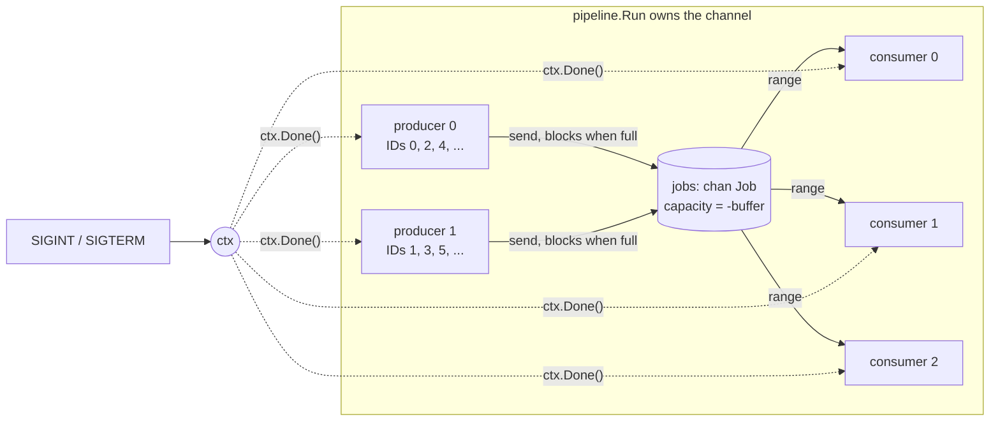

# go-concurrency

How do goroutines and channels give me a producer/consumer pipeline with backpressure, clean
shutdown and no leaks? This prototype runs N producer goroutines and M consumer goroutines over one
shared channel. It shows that a blocking send is all the backpressure you need, that exactly one
party may close the channel, and that a context lets you stop everything mid-run without leaving a
goroutine behind.

## Concept

**Channel operations block, and that's how they work, not a fault.** On an *unbuffered* channel a send
completes only when a receiver takes the value: a rendezvous. A *buffered* channel of capacity N
lets N sends complete with no receiver. Send N+1 then blocks until someone receives. A goroutine
blocked on a channel is parked by the runtime and uses no CPU.

**Backpressure is a blocked send.** When consumers fall behind, the buffer fills and producers block
on their next send. Nothing extra needs building, and memory stays bounded: at most `consumers +
buffer` jobs are ever in flight.

**Closing means "no more values".** After `close(ch)`, receivers first drain whatever is buffered.
After that, a receive returns the zero value with `ok == false`, and `for v := range ch` ends. Sending
on a closed channel panics. So does closing it twice, or closing a nil channel.

**The sender side closes.** A receiver can't know whether another send is coming, so closing from
the receiving side races with senders. With several producers, no single producer can close either,
because the others may still be sending. The rule is one owner that waits for every sender
(`sync.WaitGroup`) and then closes, in exactly one place.

**A nil channel blocks forever.** The zero value of a `chan` type is `nil`. Send and receive on it
block forever, and `close` panics. Inside a `select`, a nil-channel case is never ready, which is
handy for switching a case off at runtime. It's also a silent bug when you forget `make`.

**Blocking is not deadlock.** The runtime's `fatal error: all goroutines are asleep - deadlock!`
fires only when *no* goroutine can ever make progress. A goroutine sleeping in `time.Sleep` *can*
make progress (a timer will wake it), so one polling loop anywhere in the program hides a real
deadlock. The program just runs forever, which is exactly how the first version of this prototype
failed.

**`select` with `default:` plus a sleep is an anti-pattern for waiting.** It turns a blocking wait
into polling. It adds up to one sleep interval of latency to every hand-off, burns wakeups, and
hides deadlocks from the runtime. It doesn't prevent a thundering herd either: the runtime hands
each sent value to exactly one waiting receiver and wakes only that goroutine. Use `default:` when
you truly have something else to do, such as a non-blocking "try send", not as a wait loop.

**Buffer size is a synchronisation choice, not deadlock protection.** Unbuffered means the sender
knows a receiver has the value. A buffer decouples the two sides to absorb bursts. A buffer never
fixes a deadlock, only delays it by N values. It doesn't raise steady-state throughput either:
that is set by how fast consumers work (see [Run](#run)).

**Cancellation travels through a `context.Context`.** Any operation that could block forever also
selects on `ctx.Done()`. Then one `cancel()` (here, wired to SIGINT/SIGTERM through
`signal.NotifyContext`) unblocks every goroutine.

## Design



`pipeline.Run(ctx, cfg)` owns everything it starts:

1. It makes the `jobs` channel with capacity `cfg.Buffer`.
2. It starts `cfg.Producers` producers. Producer `p` sends job IDs `p, p+P, p+2P, ...`, so every ID
   in `[0, jobs)` is produced exactly once. Each job carries a simulated duration drawn from
   `[0, 2*work)` by a per-producer PCG source seeded with `(seed, p)`. Durations are reproducible
   no matter how the scheduler interleaves producers.
3. It starts `cfg.Consumers` consumers, each `range`-ing over the channel. Whichever consumer is idle
   takes the next job, so faster consumers do more of the work.
4. It runs `producers.Wait()`, then `close(jobs)`, then `consumers.Wait()`. That is the only place
   the channel is closed, and it runs only after every sender has returned.
5. It returns `Stats`. Every goroutine has written only its own slice slot, and `WaitGroup.Wait`
   orders those writes before Run reads them, so no mutex is needed. `-race` confirms it.

Shutdown has two paths:

- **Work done.** Producers finish their share and return, Run closes the channel, consumers drain it
  and their `range` loops end. Run returns `nil`.
- **Cancelled.** A producer checks `ctx.Err()` before each job and selects on `ctx.Done()` alongside
  the send, so even a producer blocked on a full channel returns at once. A consumer checks `ctx`
  before each job and sleeps with a timer that also selects on `ctx.Done()`, so it abandons what's
  left in the buffer and interrupts the job in hand. An interrupted job does not count as consumed.
  Run returns `ctx.Err()` with exact partial `Stats`.

Either way, no goroutine started by Run is still running when it returns. The tests check this.

```
main.go                     flags, signal wiring, summary, exit codes
main_test.go                exit codes; real SIGINT/SIGTERM sent to a real process
internal/pipeline/          Config, Validate, Run, Stats
```

## Run

Requires Go 1.22+ (developed with 1.23.4).

```console
$ make run
go build -o bin/go-concurrency .
bin/go-concurrency -producers 2 -consumers 4 -jobs 100 \
		-buffer 10 -work 10ms -seed 1
running: producers=2 consumers=4 jobs=100 buffer=10 work=10ms seed=1
consumed 100/100 jobs in 254ms (produced 100)
per consumer: [26 29 22 23]
producers blocked on send: 412ms in total (backpressure)
```

| Make variable | Default | Flag | Meaning |
|---|---|---|---|
| `PRODUCERS` | `2` | `-producers` | producer goroutines, 1 to 10000 |
| `CONSUMERS` | `4` | `-consumers` | consumer goroutines, 1 to 10000 |
| `JOBS` | `100` | `-jobs` | total jobs, 0 to 1e9 |
| `BUFFER` | `10` | `-buffer` | channel capacity, 0 (unbuffered) to 1e6 |
| `WORK` | `10ms` | `-work` | mean simulated work per job, 0 to 1h |
| `SEED` | `1` | `-seed` | seed for the per-job durations |
| `ARGS` | empty | | extra flags, e.g. `ARGS=-v` to log every finished job to stderr |
| `BIN` | `bin/go-concurrency` | | where `make build` writes the binary |

For example: `make run CONSUMERS=8 BUFFER=0` or `make run ARGS=-v`.

The flag defaults match the Make defaults. The summary goes to stdout, and logs, usage and errors go to
stderr.

| Exit status | Meaning |
|---|---|
| 0 | every job consumed |
| 1 | runtime failure |
| 2 | bad flags or arguments; every problem is listed, followed by usage |
| 130 | cancelled by SIGINT or SIGTERM after a clean shutdown (`signal.NotifyContext` can't tell them apart) |

Ctrl+C mid-run stops promptly and reports exactly what was left unfinished:

```console
$ bin/go-concurrency -jobs 100000 -work 50ms    # Ctrl+C after ~300ms
running: producers=2 consumers=4 jobs=100000 buffer=10 work=50ms seed=1
consumed 20/100000 jobs in 285ms (produced 34)
per consumer: [4 5 7 4]
producers blocked on send: 569ms in total (backpressure)
interrupted: finished 20 of 100000 jobs; 14 produced jobs were left unfinished
$ echo $?
130
```

The 14 unfinished jobs are the 4 in the consumers' hands plus the 10 in the buffer, so in-flight
work is exactly `consumers + buffer`. The process exited 7 to 9 ms after the signal, with no
process left behind.

### What buffer size and consumer count actually change

Methodology: `producers=2 jobs=100 work=10ms seed=1`, 5 runs per row, median reported. Machine:
Apple M3 (8 cores), macOS, Go 1.23.4. Reproduce each row with `bin/go-concurrency -consumers C
-buffer B`.

| consumers | buffer | elapsed | producers blocked on send (sum of both) |
|---|---|---|---|
| 2 | 0 | 501 ms | 976 ms |
| 2 | 10 | 502 ms | 824 ms |
| 2 | 100 | 499 ms | 19 µs |
| 1 | 10 | 1022 ms | |
| 2 | 10 | 501 ms | |
| 4 | 10 | 253 ms | |
| 8 | 10 | 130 ms | |

The buffer changes *who waits*, not how long the work takes. Elapsed time stays at about 500 ms
for every buffer size. A buffer as large as the job count lets the producers drop everything and
leave almost at once. A small buffer only trims the producers' waiting at the start and end.
Throughput scales with consumers, because they are the bottleneck: 100 jobs × 10 ms ÷ C
consumers. Per-consumer counts vary from run to run (for example `[23 23 27 27]`), because work is
shared by whoever is idle, not dealt round-robin.

## Test

```console
$ make check
go vet ./...
staticcheck ./...
golangci-lint run ./...
go test -race -count=1 ./...
ok  	github.com/brayomumo/Psychic-compendium/go-concurrency	1.267s
ok  	github.com/brayomumo/Psychic-compendium/go-concurrency/internal/pipeline	2.192s
```

`make check` runs gofmt, `go vet`, staticcheck, golangci-lint (the repo-wide `.golangci.yml`) and
then the tests, all under the race detector. `make test` runs only the tests. The suite was also
run 30 times (`go test -race -count=10 -cpu 1,2,8 ./...`) without a failure.

## Failure modes

| Failure mode | What happens | How it's handled | Test |
|---|---|---|---|
| Consumers slower than producers | The buffer fills and producers block on send | Blocking send is the backpressure. In-flight work is capped at `consumers + buffer`. | `TestBackpressureBoundsJobsInFlight`, `TestBufferSizeControlsProducerBlocking` |
| Producers finish | Consumers must learn there is no more work | Run closes the channel once all producers return, and consumers' `range` ends | `TestConsumersExitWhenChannelIsClosed_RegressionNilQuitChannel` |
| Several producers sharing one channel | One closing early would make the others panic with "send on closed channel" | A single close, after `producers.Wait()` | `TestRunProcessesEveryJobExactlyOnce` (3 producers, `-race`) |
| More producers than jobs | Some producers have nothing to send | They return immediately, and the close still happens once | `TestRunWithMoreProducersThanJobs` |
| More consumers than jobs | Some consumers never get a job | They block in `range` until the close, then return | `TestRunExitCodes/more_consumers_than_jobs` |
| Zero jobs | Nothing to do | Producers return at once, Run closes and returns | `TestRunWithZeroJobsReturnsImmediately` |
| A job lost or processed twice | Wrong results | IDs are partitioned by stride and each received value goes to exactly one consumer. The full multiset of IDs is checked across 36 configurations. | `TestRunProcessesEveryJobExactlyOnce` |
| Ctrl+C or SIGTERM mid-run | Work must stop promptly | `signal.NotifyContext` cancels ctx, the partial summary is printed, exit 130 | `TestInterruptSignalExitsCleanly` (real signal, real process), `TestRunReportsInterruption` |
| Cancel while producers are blocked on send | A plain send would block forever | Producers select on `ctx.Done()` next to the send | `TestCancellationStopsEveryGoroutine` |
| Cancel while consumers are mid-job | A plain `time.Sleep` would finish the job regardless | The work timer selects on `ctx.Done()`, and the interrupted job is not counted | `TestCancellationStopsEveryGoroutine` |
| Cancel before Run starts | `select` picks at random among ready cases, so sends could still win | Producers and consumers check `ctx.Err()` first, so nothing is consumed | `TestCancelledBeforeStartConsumesNothing` |
| Goroutine leak | Memory and goroutines grow, and the process may never exit | Run waits for every goroutine it starts. Tests poll `runtime.NumGoroutine` back to its baseline. | regression and cancellation tests |
| Data race on the stats | Corrupt counts | One slot per goroutine, read after `WaitGroup.Wait` | the whole suite under `-race` |
| Zero, negative, huge or malformed flags; unknown flags; stray arguments | Panics or nonsense in the first version | `Config.Validate` reports every problem at once, and the command exits 2 with usage | `TestValidate`, `TestValidateReportsEveryProblem`, `TestRunExitCodes` |
| Same seed, different run | Durations should repeat | One PCG source per producer, seeded with `(seed, producer)` | `TestSeedMakesJobDurationsReproducible` |
| Slow `OnJob` hook (for example `-v` logging) | Slows the consumer that calls it | Documented on `Config.OnJob`. `log.Logger` is safe for concurrent use. | `TestRunVerboseLogsEveryJob` |

## What the first version got wrong

1. **The quit channel was nil.** `Newconsumer` never called `make(chan int)`, so `quit` held the
   zero value. A receive from a nil channel never fires, so `case <-c.quit` was dead code. A send
   to a nil channel blocks forever, so every call to `exit()` leaked a goroutine (a probe showed 3
   → 9 goroutines). *Lesson:* channels must be made. A nil channel fails silently, and neither the
   compiler nor `go vet` catches it.
2. **The program never exited.** Consumers had no way to learn the producer was done. The channel
   was closed only after `wait_group.Wait()`, and that wait was waiting for the consumers: a
   circular wait. *Lesson:* closing is the "done" signal. It must come from the sending side
   *before* you wait for the receivers.
3. **Both sides polled with `select { ...; default: sleep }`.** Consumers slept up to 4 s and the
   producer 2 s between attempts. Hand-offs were slow, and the sleeping goroutines kept the
   runtime's deadlock detector quiet, so the hang looked like normal idling. The "jitter against a
   thundering herd" rationale doesn't apply, because a send wakes exactly one receiver. *Lesson:*
   block on the channel and let the runtime schedule.
4. **Consumers quit after a random quota (`max_jobs`).** The quotas came from `rand.Intn` and
   usually summed to fewer than the 100 jobs. Had the quit channel worked, the consumers would have
   quit and left the producer blocked on a full buffer forever. *Lesson:* a receiver that walks
   away from a channel strands its senders unless they are told to stop (cancellation) or the
   receiver keeps draining. The quota is gone: termination comes from the producers closing the
   channel, and early stop comes from the context.
5. **There was an off-by-one in the quota.** `jobs_handled > Max_jobs` was checked after the receive
   and before the increment, so a consumer would have processed at least `Max_jobs + 2` jobs.
6. **There was no input validation.** `--consumers 150` panicked in `rand.Intn(0)` (integer division
   100/150 is 0) and `--consumers -2` panicked with `sync: negative WaitGroup counter`. *Lesson:* validate at
   the boundary and fail with exit 2 and a message, not a panic.
7. **The docs taught the wrong model.** The README called a buffer's capacity "the amount of data it
   can hold before deadlocks occur" and described ordinary blocking as deadlock. It documented
   `make run consumers=<n>`, which Make silently ignored because the variable was `CONSUMERS`
   (Make variables are case-sensitive), and a `--consumer` flag that didn't exist.
8. **Smaller issues.** The repo-root `go.work` listed only this module, which broke every `go`
   command inside `todo-cli`. The modules are independent, so it's deleted. A TODO asked to make
   `jobs_handled` per-consumer, but it was already a local variable. `math/rand` was never seeded:
   before Go 1.20 that meant identical "random" numbers on every run, and since 1.20 a different
   seed each run, so a run could not be reproduced on demand. The seed is now an explicit flag.

## Trade-offs and limits

- **Shared-channel work distribution suits independent, similar-sized jobs.** It doesn't preserve
  order: jobs finish in whatever order consumers complete them. Ordered output needs sequence
  numbers and a reorder buffer, or one channel per key.
- **Cancellation abandons buffered jobs.** It doesn't drain them, and Stats reports exactly how many
  were left unfinished. The alternative is a graceful drain: stop the producers, let consumers
  finish what is queued, then enforce a deadline. That is the better choice when jobs are expensive
  to redo. Either way, a real system needs jobs that are safe to retry, because a crash loses
  in-memory work regardless.
- **Single process, in memory.** Nothing survives a crash. For durable hand-off between processes,
  use a broker with acknowledgements (see the `pub-sub` prototype).
- **Jobs cannot fail here.** A real pipeline needs per-job errors and usually cancels on the first
  fatal one (`golang.org/x/sync/errgroup`). A panic in any goroutine crashes the whole program. Only
  recover per job if jobs are untrusted, and then report the failure rather than swallowing it.
- **`SendWait` costs two `time.Now()` calls per job.** That's negligible next to real work, but it
  would show up in a microbenchmark of raw channel throughput.
- **Not covered:** multi-stage fan-out/fan-in pipelines, result channels, rate limiting, and
  dynamically resizing the consumer pool. Those are natural next steps.
