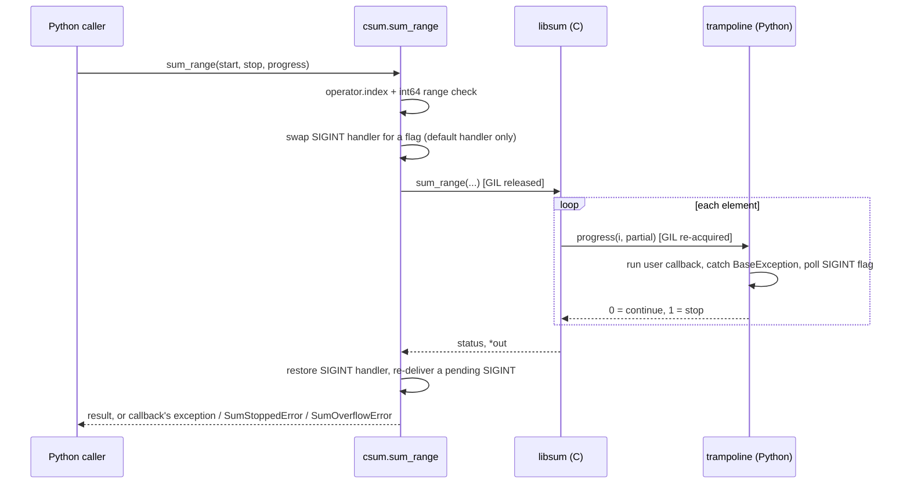

# C from Python with ctypes

How does Python call into a C library with `ctypes`, and how do control
(callbacks), errors, and Ctrl+C cross that boundary safely in both directions?
The prototype is a tiny C library, `libsum`, that sums a range and reports
progress through a callback. Around it sits a Python wrapper that does
everything ctypes leaves to the caller.

## Concept

`ctypes` loads a shared library at runtime (`dlopen`) and looks functions up by
name. It never sees the C header, so it knows nothing about signatures:

- **Signatures are your job.** Without `argtypes`/`restype`, ctypes passes a
  Python int as a C `int` and reads the result as a C `int`. A 64-bit value is
  silently truncated. Declaring them makes ctypes convert and type-check each
  argument.
- **Integer conversion still truncates.** Even with `argtypes` declared,
  `ctypes.c_int64(2**64 + 5).value == 5`. Python ints are unbounded and C ints
  are not, so range checks belong in the wrapper.
- **Design the C API for the boundary.** Use fixed-width types (`int64_t`), and
  return a status code with the result in an out-param. Return the status as
  `int`, because the size of an `enum` is implementation-defined. A library
  that prints or aborts takes decisions away from its caller.
- **Callbacks are thunks with a lifetime.** `CFUNCTYPE(...)(pyfunc)` builds a
  C-callable function pointer. The pointer is freed when that Python object is
  garbage-collected, and C calling it afterwards is a use-after-free. Keep a
  reference for as long as C can call it.
- **Exceptions cannot unwind through C frames.** If a callback raises, ctypes
  reports it to `sys.unraisablehook` ("Exception ignored while calling ctypes
  callback function"), hands C an unspecified return value (zero in practice),
  and C keeps running. The fix is a trampoline. It catches everything, tells C
  to stop, and re-raises after C returns.
- **Signals only run between bytecodes.** Python runs a signal handler at the
  next bytecode boundary, in the main thread. During a C call that is the
  first instruction of the next callback. That's before any `try` in it, so the
  `KeyboardInterrupt` escapes the callback and ctypes swallows it like any
  other exception. Ctrl+C is lost. With no callback at all, Ctrl+C waits
  until C returns.
- **The GIL.** `ctypes.CDLL` releases the GIL for each foreign call;
  `ctypes.PyDLL` keeps it. A callback re-acquires the GIL before running
  Python. So C code can run in parallel with other Python threads, and every
  callback pays for a GIL acquisition plus argument conversion.

## Design

| File | Role |
|---|---|
| `sum.h`, `sum.c` | The C library: `int sum_range(int64_t start, int64_t stop, sum_progress_fn progress, void *user_data, int64_t *out)` |
| `csum.py` | The wrapper: declares signatures, validates input, owns callbacks, maps status codes to exceptions, defers Ctrl+C |
| `main.py` | Walkthrough demo, plus `--until-interrupted` for a long C call |
| `bench.py` | Measures the callback round trip and proves the GIL is released |
| `ub_demo.c` | The first version's buggy function, kept for `make ub-demo` |
| `tests/test_sum.c` | Native C tests, built with ASan + UBSan (`make test-c`) and, on Linux, MSan (`make test-msan`) |
| `tests/test_csum.py`, `tests/test_main.py` | Python tests |
| `usable-sanitizers.sh` | Probes ASan before the native test; drops it with a warning, or fails under `REQUIRE_ASAN=1` |

`sum_range(start, stop)` computes `sum(range(start, stop))`. The first version
summed `range(n)`. A start offset makes overflow testable in two iterations
instead of four billion, and Python's own `sum(range(...))` becomes an exact
oracle for the tests.



**Ownership and shutdown.** There are no threads or processes to stop. The
library handle lives for the life of the process. The callback thunk is a
local of `sum_range`, so it lives exactly as long as the C call; `libsum` never
keeps the pointer after returning. The SIGINT swap is a context manager that
restores the previous handler even when the call raises.

**Error mapping.**

| C status | Python |
|---|---|
| `SUM_OK` | the result |
| `SUM_STOPPED` | `SumStoppedError(partial)`, or the callback's exception if it raised, or `KeyboardInterrupt` |
| `SUM_ERR_OVERFLOW` | `SumOverflowError` (also an `OverflowError`) |
| `SUM_ERR_INVALID_ARG` | can't happen through the wrapper (`out` is never NULL) |

## Run

```console
$ make run
python3 main.py
1. The original demo, fixed: sum(range(0, 100)) in C
  sum_range(0, 100)                      4950
2. Control crosses back into Python through a callback
  progress(index=0)                      0
  ...
3. The callback can stop C early
  stop once partial >= 20                SumStoppedError(21)
4. C status codes and bad input become exceptions
  sum_range(INT64_MAX - 2, INT64_MAX)    SumOverflowError: sum of range(...) overflows int64_t
  sum_range(0, 2**64)                    OverflowError: stop=18446744073709551616 does not fit in a C int64_t
  sum_range(0, 1.5)                      TypeError: 'float' object cannot be interpreted as an integer
  why: ctypes.c_int64(2**64 + 5).value   5
5. A callback that raises at index 3
  raw ctypes: reported as unraisable     ValueError('bad element 3')
  raw ctypes: C kept going               status=0 result=45 after 10 callbacks
  wrapper                                ValueError('bad element 3') re-raised after 4 callbacks
```

`python3 main.py --until-interrupted` runs a C loop with a progress callback
until you press Ctrl+C. It exits 130 within a few milliseconds of the signal:

```console
$ python3 main.py --until-interrupted
INFO summing in C with a progress callback; press Ctrl+C to stop
INFO index=0 partial=0
^CINFO interrupted; C stopped at the next callback
$ echo $?
130
```

Exit codes: 0 success; 1 runtime failure (the library isn't built, checked
before any output); 2 usage error; 130 Ctrl+C. SIGTERM keeps its default
action, so the process dies at once and a shell reports 143. There is nothing
to clean up.

### Benchmarks

`make bench` backs the two performance claims in this README:

```console
$ make bench
arm64 Darwin 25.6.0, 8 CPUs, Python 3.14.7, median of 5
callback round trip: 157 ns per call
  sum_range(0, 1_000_000) with no-op callback 0.158 s, without 0.7 ms
GIL: 2 threads each summing range(0, 500_000_000), no callback
  CDLL  (releases GIL) one call 0.381 s, two threads 0.475 s -> 1.25x the time of one
  PyDLL (holds GIL)    one call 0.372 s, two threads 0.789 s -> 2.12x the time of one
```

Methodology: each figure is the median of `--repeats` runs (default 5), timed
with `time.perf_counter`. The callback cost is `(time with a no-op callback −
time without) / elements`. The GIL test runs the same C function from two
threads at once, loading the library once with `CDLL` and once with `PyDLL` as
the control. On an otherwise busy machine (load average about 7 on 8 CPUs),
three runs gave two-thread/one-call ratios of 0.98–1.25x for CDLL and
1.99–2.12x for PyDLL. A ratio near 1 means the threads ran in parallel; near 2
means they took turns holding the GIL.

## Test

On macOS (Apple clang 17, Python 3.14), where ASan can't run (see
Trade-offs):

```console
$ make check
uvx ruff@0.16.10 check .
All checks passed!
uvx ruff@0.16.10 format --check .
uvx mypy@2.4.0 .
Success: no issues found in 5 source files
cc --analyze -Xclang -analyzer-werror -std=c11 -o /dev/null sum.c
warning: AddressSanitizer does not work with cc here (an empty ASan program hung for 3 s at startup); using the rest. Set REQUIRE_ASAN=1 to make this an error.
+ cc -std=c11 -Wall -Wextra -Wpedantic -Werror -Wconditional-uninitialized -O2 -g ... -fsanitize=undefined -fno-sanitize-recover=all -o build/test_sum tests/test_sum.c sum.c
+ build/test_sum
test_sum: all tests passed
python3 -m unittest discover -s tests -v
...
Ran 31 tests in 0.306s
OK
$ make check REQUIRE_ASAN=1
...
error: REQUIRE_ASAN=1 but AddressSanitizer does not work with cc here: an empty ASan program hung for 3 s at startup
make: *** [test-c] Error 1
```

On Linux (Ubuntu 24.04, clang 18.1.3, Python 3.12.3), ASan runs and MSan is
available. This is the CI configuration:

```console
$ make check CC=clang REQUIRE_ASAN=1
...
clang --analyze -Xclang -analyzer-werror -std=c11 -o /dev/null sum.c
+ clang -std=c11 -Wall -Wextra -Wpedantic -Werror -Wconditional-uninitialized -O2 -g -fno-omit-frame-pointer -fsanitize=address,undefined -fno-sanitize-recover=all -o build/test_sum tests/test_sum.c sum.c
+ build/test_sum
test_sum: all tests passed
clang ... -fPIC -shared -o build/libsum.so sum.c
python3 -m unittest discover -s tests -v
...
Ran 31 tests in 0.082s
OK
$ make test-msan CC=clang
clang -std=c11 -Wall -Wextra -Wpedantic -Werror -Wconditional-uninitialized -O1 -fsanitize=memory -fsanitize-memory-track-origins=2 -fno-omit-frame-pointer -g -o build/test_sum_msan tests/test_sum.c sum.c
build/test_sum_msan
test_sum: all tests passed
```

| Target | What it does |
|---|---|
| `make build` (default) | Builds `build/libsum.dylib` (macOS) or `build/libsum.so` (Linux) with strict warnings |
| `make run` | Runs the walkthrough |
| `make test` | `test-c` (native C tests under `SANITIZERS`) then `test-py` (unittest) |
| `make test-msan` | Native C tests under MemorySanitizer. clang on Linux only; elsewhere it exits 2. Not part of `test` |
| `make lint` | ruff check, ruff format check, mypy, clang static analyzer (when `CC` is clang) |
| `make check` | `lint` then `test`. This is the gate |
| `make bench` | The measurements above |
| `make ub-demo` | Reproduces the first version's undefined behaviour (clang only; adds an MSan row on Linux) |
| `make clean` | Removes `build/` and tool caches |

| Variable | Default | Purpose |
|---|---|---|
| `CC` | `cc` | C compiler |
| `CFLAGS` | `-O2` | Appended after `-std=c11` and the strict warning flags |
| `PYTHON` | `python3` | Interpreter for the demo and tests |
| `RUFF` | `uvx ruff@0.16.10` | Linter and formatter |
| `MYPY` | `uvx mypy@2.4.0` | Type checker (strict, configured in `pyproject.toml`) |
| `SANITIZERS` | `address,undefined` | For the native test in `test-c` |
| `REQUIRE_ASAN` | `0` | `0`: if ASan can't run, warn and drop it from `SANITIZERS`. `1`: fail `test-c` (and `check`) instead. CI sets `1` so a broken ASan can never pass as a UBSan-only run. Any other value, or `1` with no `address` in `SANITIZERS`, is a usage error |

The native tests (`tests/test_sum.c`) build with `-fno-sanitize-recover=all`.
I checked that each sanitizer bites by breaking the code on purpose:

| Injected bug | Sanitizer | Result |
|---|---|---|
| Overflow guard removed from `sum.c` | UBSan (macOS and Linux) | `runtime error: signed integer overflow: 9223372036854775805 + 9223372036854775806` |
| Test loop reads one past its array (`k <=`) | ASan (Linux) | `ERROR: AddressSanitizer: global-buffer-overflow ... READ of size 8 ... in test_sums` |
| `int64_t acc = 0;` changed to `int64_t acc;` | MSan (Linux) | `WARNING: MemorySanitizer: use-of-uninitialized-value` |

### Linux and CI

Verified in a `ubuntu:24.04` container on Docker 27.4: in full on
linux/arm64 (native), and on linux/amd64 under emulation with the limits noted
in Trade-offs. These are the commands a GitHub Actions `ubuntu-24.04` job
needs:

```sh
sudo apt-get update
# libclang-rt-18-dev holds the sanitizer runtimes; the clang package alone
# can't link -fsanitize=address. llvm-18 provides llvm-symbolizer, which
# turns sanitizer reports into file:line stack traces.
sudo apt-get install -y --no-install-recommends clang libclang-rt-18-dev llvm-18 make python3
export PATH="/usr/lib/llvm-18/bin:$PATH"    # llvm-symbolizer
# plus uv (astral-sh/setup-uv, or: curl -LsSf https://astral.sh/uv/install.sh | sh)
cd lower_with_c_and_python
make check CC=clang REQUIRE_ASAN=1
make test-msan CC=clang
make run CC=clang
```

`REQUIRE_ASAN=1` earned its place on the first Linux run: without
`libclang-rt-18-dev`, the ASan probe failed with `cannot find
.../libclang_rt.asan_static-aarch64.a`. Under the default it would have quietly
dropped to UBSan. Also checked on that container: `make test-c CC=gcc
REQUIRE_ASAN=1` (GCC 13.3, the runner's default `cc`) passes with ASan +
UBSan, and the Python tests pass on 3.11.13 (uv-managed) as well as 3.12.3.

## Failure modes

| Failure mode | What happens | How it's handled | Test |
|---|---|---|---|
| Library not built, or built for another architecture | `ctypes.CDLL` raises a bare `OSError` | `LibraryLoadError` says to run `make build`; `main.py` exits 1 before printing anything | `test_missing_library_says_how_to_build_it`, `test_unloadable_file_raises_library_load_error`, `test_missing_library_exits_1_with_build_hint` |
| Run from another directory | A relative `./libsum.so` isn't found | Path resolved from `__file__`, with the platform suffix | `test_loads_from_any_working_directory`, `test_library_path_has_platform_suffix` |
| Missing `argtypes`/`restype` | 64-bit arguments and results are truncated to `int` | `declare_signatures()` declares every function in one place | Every 64-bit case in `test_matches_python_sum_of_range` |
| Python int outside int64 | ctypes silently truncates (`2**64 + 5` becomes `5`) | `OverflowError` before calling C | `test_out_of_range_input_raises_instead_of_truncating` |
| Float, string, `None` as input | Would be converted or rejected unpredictably | `operator.index`, exactly what `range()` accepts | `test_rejects_non_integers_like_range`, `test_accepts_what_range_accepts` |
| Partial sum overflows int64 | Signed overflow is undefined behaviour in C | Checked before adding; `SUM_ERR_OVERFLOW` becomes `SumOverflowError`; `*out` untouched | `test_overflow_reports_error_and_leaves_out_unchanged` (C), `test_partial_sum_overflow_raises_sum_overflow_error`, `test_overflow_happens_exactly_when_a_partial_sum_leaves_int64` |
| Empty or reversed range | | Sums to 0, no callbacks, like `range()` | `test_sums`, `test_progress_not_called_for_empty_range` (C and Python) |
| NULL out-param from a C caller | Would write through NULL | `SUM_ERR_INVALID_ARG` | `test_null_out_is_invalid` (C) |
| Callback raises | ctypes prints "Exception ignored", C runs to completion | Trampoline catches `BaseException`, returns stop, re-raises with the original traceback | `test_raw_ctypes_swallows_callback_exceptions`, `test_callback_exception_stops_c_and_is_reraised`, `test_base_exceptions_from_callback_are_reraised` |
| Callback wants to stop | | Truthy return stops C; `SumStoppedError(partial)` | `test_progress_can_stop_early` (C), `test_truthy_return_stops_early_with_partial_sum` |
| Ctrl+C while C is calling back | `KeyboardInterrupt` raised at callback entry is swallowed: lost in 4 of 5 runs of the first probe, and 5 of 5 in the regression test with the fix disabled | SIGINT sets a flag during the call; callbacks stop C; the signal is re-delivered after return | `test_async_sigint_during_c_call_is_never_lost`, `test_sigint_during_callback_stops_c_right_after_it`, `test_sigint_mid_c_call_exits_130_promptly` |
| Ctrl+C with no callback | Noticed only when C returns | Inherent; see Trade-offs | (documented) |
| SIGINT ignored, or a custom handler installed | Overriding it would change the application's behaviour | Only Python's default handler is swapped | `test_ignored_sigint_does_not_stop_c`, `test_custom_sigint_handler_is_left_alone`, `test_sigint_handler_is_restored_after_the_call` |
| SIGTERM | Default action | Process exits at once (143); nothing to clean up | `test_sigterm_terminates_immediately` |
| Callback collected while C holds the pointer | Use-after-free crash | The wrapper keeps the thunk alive for the whole call; `libsum` never stores it | (by construction; reproducing it would be undefined behaviour) |
| Called from a worker thread | `signal.signal` raises `ValueError` off the main thread | Deferral skipped (handlers only run in the main thread anyway) | `test_callbacks_work_on_worker_threads` |
| Concurrent calls | Shared state would mix up exceptions | Per-call closure; no globals | `test_concurrent_calls_keep_their_own_exceptions` |
| Re-entrant call from a callback | | Works. The inner call sees the outer call's flag handler, so it doesn't defer again; on Ctrl+C the inner call finishes and the outer one stops | `test_reentrant_call_from_callback` |
| C and Python both printing | Two stdio buffers; piped output reorders | The library never prints; progress goes through the callback | (by construction) |
| Uninitialised variable (first version) | Undefined behaviour; garbage that changes per build and run | `-Wconditional-uninitialized -Werror` and `clang --analyze` in `make check`; both reject `ub_demo.c` | `make ub-demo`, `make lint` |
| ASan broken or missing on the toolchain | `make check` would hang (macOS) or fail to link (Linux without `libclang-rt-18-dev`) | Probe with a 3 s timeout. Default: fall back to the other sanitizers with a warning. `REQUIRE_ASAN=1`: fail with the reason | Both observed: macOS hang, Ubuntu missing runtime |

## What the first version got wrong

1. **It never ran.** `_sum.hello.argtypes = ...` names a symbol that doesn't
   exist, so the script died at import with `dlsym(..., hello): symbol not
   found`. ctypes resolves symbols lazily, by name, at runtime, so a typo is a
   runtime error. Lesson: put every declaration in one function that the tests
   exercise.
2. **No signature for `sum`.** It happened to work because every argument and
   the result were `int`, which is what ctypes assumes. Any `int64_t`, pointer
   or `double` would have broken silently.
3. **`int i, sum;` left `sum` uninitialised.** Reading it is undefined
   behaviour. The same code returned 4950 at `-O0` inside the Python process
   and 1797663254 at `-O2`. Standalone on macOS it gives a different garbage
   value on every run (ASLR moves the stack). On Linux it printed the right
   answer, 4950, at `-O0` (the stack slot happened to be zero) and 4951 with
   UBSan. "It works at -O0" was luck. What catches it (`make ub-demo`
   reproduces this):

   | Tool | Apple clang 17, macOS | clang 18, Ubuntu 24.04 |
   |---|---|---|
   | `-Wall -Wextra` at `-O0` to `-O3` | No | No |
   | `-Wuninitialized`, `-Wsometimes-uninitialized` | No | not tried |
   | `-Wconditional-uninitialized` (not in `-Wall`/`-Wextra`) | Yes, now in the build with `-Werror` | Yes |
   | `clang --analyze` | Yes, now in `make lint` | Yes |
   | UBSan | No: it doesn't track initialisation (garbage) | No (4951) |
   | ASan | No: it detects bad addresses, not uninitialised values | not tried, same reason |
   | MSan | Not available on macOS | **Yes**, at every `-O` level (below) |
   | `-ftrivial-auto-var-init=pattern` | Deterministic and visibly wrong (-1431650816) | Same |
   | `-ftrivial-auto-var-init=zero` | Hides it (4950) | Same |

   MSan is the tool built for exactly this bug. At `-O0` it reports the read
   at its source line, with origin tracking pointing back at the loop:

   ```console
   $ make ub-demo CC=clang     # Linux; last row
     -O0 -fsanitize=memory      MemorySanitizer: use-of-uninitialized-value in sum() ub_demo.c:21
   ```

   Line 21 is `callback_type(sum);`. Since clang 16, MSan checks function
   arguments eagerly, so passing the garbage to the callback is the first
   reported use. At `-O1`/`-O2` it still fires, but `sum()` is inlined and the
   report points at the `printf` in `main`, with origin tracking unable to say
   where the value came from ("ORIGIN: invalid"). That's why the demo row uses
   `-O0`, and `make test-msan` uses `-O1`, as the MSan docs recommend for
   speed.

4. **`int` overflows early.** `sum(range(65537))` is 2,147,516,416, past
   `INT_MAX`, so any `num` above 65,536 was signed overflow, which is also
   undefined behaviour. Now: `int64_t`, with overflow checked before each add.
5. **C printed while Python printed.** C `printf` and Python `print` have
   separate buffers. When piped, all of Python's lines came out before C's.
   A library shouldn't do I/O; it reports through return values and callbacks.
6. **The library path depended on the working directory** (`./libsum.so`).
7. **The callback was one-way.** There was no way to stop C, an exception in
   it would have been swallowed, and Ctrl+C during the loop would usually
   have been lost. The Ctrl+C race only showed up by measuring it. That is the
   main lesson of this prototype: a trampoline that "catches all exceptions"
   still can't catch one raised before its first line.
8. **Makefile:** `python` (not installed on modern macOS), no `.PHONY`, no
   tests, no warnings.

## Trade-offs and limits

- **ctypes has no compile-time check.** If `sum.h` and `declare_signatures()`
  drift apart, only the tests notice. The status constants in `csum.py` are
  hand-copied from the header. `cffi` can parse the C declarations, and a C
  extension or Cython can raise Python exceptions directly. Both are better
  for a real binding. ctypes wins when you want no build step on the Python
  side.
- **Callbacks are expensive.** About 160–190 ns per round trip here, against
  under 1 ns per element in pure C, so a per-element callback makes this
  workload about 200x slower. A real API would report progress every N
  elements; this one calls back per element to keep the demo simple.
- **Ctrl+C can't interrupt C that never calls back.** The signal is honoured
  when C returns. For long callback-free calls, run them in a worker thread or
  process, or give the C code a cancellation flag (an atomic int) to poll.
- **The SIGINT deferral is narrow on purpose.** It covers the main thread and
  Python's default handler only. A custom SIGINT handler that raises, or a
  Python handler for another signal that raises, still hits the swallow race.
- **Callback lifetime is easy here** because `libsum` uses the pointer only
  during the call. An API that stores a callback (registration, async
  completion) needs the Python side to keep the thunk alive until it is
  unregistered, usually on an object with an explicit `close()`.
- **ASan doesn't run on macOS here.** With Apple clang 17 on macOS 26.6 it
  hangs at startup in `FindDynamicShadowStart`, even for an empty program, so
  local `make check` on this Mac runs the native tests under UBSan only. ASan
  and MSan coverage comes from Linux (CI), where `REQUIRE_ASAN=1` makes sure
  it really runs.
- **x86_64 was checked under emulation only** (linux/amd64 on an arm64 Mac).
  There, ASan (with `ASAN_OPTIONS=detect_leaks=0`), UBSan, the analyzer and
  the Python tests all pass. LeakSanitizer ("does not work under ptrace") and
  MSan (can't map its shadow memory) can't start under the emulator, and
  `REQUIRE_ASAN=1` correctly fails on the LSan error. Both work in the native
  arm64 container, and GitHub's x86_64 runners are real VMs, so the first CI
  run is the remaining confirmation for x86_64.
- **Not covered:** Windows (`.dll`, no Makefile support), free-threaded Python
  builds, and GCC (the Makefile adds clang-only flags only when `CC` is clang;
  GCC's equivalent warning is `-Wmaybe-uninitialized`, untested here).
