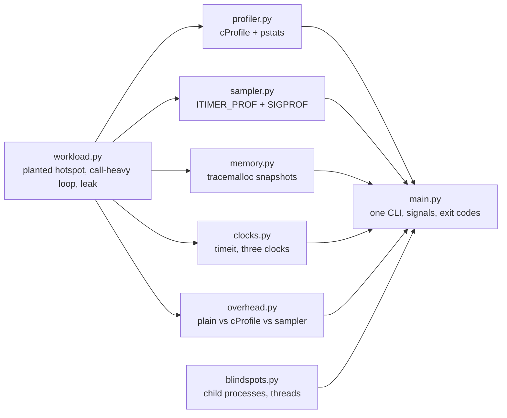

# profiling

How do I find out where a Python program actually spends its time and memory,
and how far can I trust what the profiler tells me? This prototype runs every
standard-library tool (cProfile, a minimal sampling profiler, tracemalloc,
timeit and the three clocks) against a workload whose problems were planted on
purpose. Because the right answer is known, the tests can check each tool
against it, measure how much each tool distorts what it measures, and show
what each tool cannot see.

## Concept

**A profiler is only trustworthy against ground truth.** [`workload.py`](workload.py)
has three planted problems with known locations:

- a quadratic membership test, `x in list` inside a loop (the CPU hotspot);
- a loop making a million one-line Python calls, next to the same arithmetic
  written inline;
- an unbounded cache that keeps every payload alive (the memory leak).

**Deterministic profiling (`cProfile`) records every call and return.** Call
counts are therefore exact. Two columns matter:

- `tottime` is the time spent in the function's own code. That's where the
  hotspot shows.
- `cumtime` includes everything the function called, so it ranks entry points
  first. High `cumtime` with low `tottime` means "the time is somewhere below
  me".

The `in` test runs in C without making a Python call, so its cost is charged to
`find_duplicates`' own `tottime`.

**Measuring changes what is measured (the observer effect).** cProfile does work
on every call, so its overhead grows with the *number of calls*, not with the
time spent. On this machine the call-heavy loop runs 3.5x slower under cProfile,
while the same arithmetic inline runs at 1.0x. Relative times are distorted:
call-heavy code looks more expensive than it is. cProfile also uses a
wall-clock timer, so time a thread spends waiting for the GIL is charged to
whatever function it was running.

**Statistical (sampling) profiling** interrupts the program at a fixed interval
and records the running stack. Its cost is one sample per interval, whatever
the code does. [`sampler.py`](sampler.py) is a minimal version: it sets
`ITIMER_PROF`, which counts *CPU* time, and its SIGPROF handler records the
interrupted frame. A function's share of the samples estimates its share of
CPU. On the same report, cProfile and the sampler agree on the hotspot (95% of
samples), and the sampler's overhead is within noise.

**Memory: `tracemalloc`** records the Python stack behind each allocation that
is still alive. Comparing two snapshots by line shows which lines allocated
memory that is *still held*, which is what a leak looks like. Memory that was
allocated and freed again doesn't appear.

**Micro-benchmarks: `timeit`** runs a statement many times per measurement,
repeats the measurement, and turns off the garbage collector while timing.
Report the **minimum** of the repeats. Interference only ever adds time, so the
fastest run is closest to the code's own cost. End-to-end benchmarks ask a
different question (what users see, noise included) and report a median.

**Three clocks answer three questions:**

| Clock | What it measures | Advances while sleeping? |
|---|---|---|
| `time.perf_counter()` | Elapsed wall-clock time | Yes |
| `time.process_time()` | CPU time of the whole process, every thread | No |
| `time.thread_time()` | CPU time of the calling thread only | No |

**What cProfile cannot see** (verified on Python 3.11, 3.12 and 3.14):

- **Child processes, ever.** Under `fork` the child records into its own *copy*
  of the profiler, which dies with it. Under `spawn` and `forkserver` the child
  starts with nothing. The fix is to profile inside each child, write one
  `.prof` per child, and merge them with `pstats.Stats.add`.
- **Other threads: it depends on the version.**
  - Up to 3.11, cProfile hooks `sys.setprofile`, which is per thread, so it
    sees only the thread that enabled it. The usual recipe was one `Profile`
    per thread.
  - From 3.12, cProfile is built on `sys.monitoring`, which is global. It
    *does* record other threads' calls, but into a single call stack, so time
    is charged to whatever function is on top of that stack, regardless of
    which thread is running. In one run the worker thread was reported at
    0.039 s and the main thread at 0.003 s, when each used 0.025 s of CPU.
  - Also from 3.12, only one profiler can be active per interpreter. Enabling a
    second one raises `ValueError` (the message differs between builds), which
    breaks the one-`Profile`-per-thread recipe.

## Design



| Module | Owns | Shutdown and cleanup |
|---|---|---|
| `workload.py` | the planted problems and the leak's cache | `forget()` drops the cache; tests and the CLI call it |
| `profiler.py` | a `cProfile.Profile` per call | `runcall` disables it even when the call raises |
| `sampler.py` | the process's single `ITIMER_PROF` timer and the SIGPROF handler | the context manager stops the timer and restores the previous handler on every exit path. It refuses to start off the main thread or over another active timer. |
| `memory.py` | tracemalloc, if it wasn't already on | stopped again only if it started it; filtering happens after both snapshots |
| `overhead.py` | a profiler or sampler per timed run | `try`/`finally` around every profiled run, so a raising run never leaves cProfile registered |
| `blindspots.py` | child processes, a worker thread | children are joined, or terminated and reaped in `finally`; the thread is joined |
| `main.py` | SIGINT and SIGTERM | handlers installed explicitly (they also work when SIGINT was inherited as ignored). The first signal unwinds via `KeyboardInterrupt` or `Terminated` and exits 130 or 143; a second signal exits immediately. |

Program output goes to stdout; logs, the signal notice and errors go to stderr.
`main.py` prints a `running: ...` line once its signal handlers are installed,
and tests use it as the readiness signal.

## Run

Requires Python 3.11+ on Linux or macOS (`ITIMER_PROF` is Unix-only) and
[uv](https://docs.astral.sh/uv/) for the lint tools. Developed on Python 3.14.7.

```console
$ make run
python3 main.py
running: cprofile sample memory timeit clocks blindspots

== cProfile: run_report(4000) by tottime (own time) ==
  tottime   cumtime     calls  function
   0.0240    0.0250         1  find_duplicates (workload.py:100)
   0.0000    0.0000         1  <method 'disable' of '_lsprof.Profiler' objects> (~:0)
   0.0000    0.0000      4000  <method 'append' of 'list' objects> (~:0)
...
== cProfile: by cumtime (including callees) ==
  tottime   cumtime     calls  function
   0.0000    0.0250         1  run_report (workload.py:156)
   0.0240    0.0250         1  find_duplicates (workload.py:100)
...
saved build/workload.prof; explore it with: python3 -m pstats build/workload.prof

== sampler: 302 samples every 1 ms of CPU time ==
   self   total  function
  95.4%   95.4%  find_duplicates (workload.py:100)
   3.0%    3.0%  normalise (workload.py:88)
   0.7%  100.0%  sample_until (sampler.py:198)
...
== tracemalloc: growth while leaking 2000 payloads ==
      KiB  blocks  line
   2064.5    2000  workload.py:236  payload = bytes(PAYLOAD_BYTES)  # LEAK: kept in the cache forever.
     72.0       1  workload.py:237  _REMEMBERED[key] = payload
     54.2    1735  workload.py:255  for key in range(start, start + n):

== timeit: find_duplicates on 4000 IDs, best of 5 ==
list membership (planted)    24.158 ms per call
set membership (fix)          0.075 ms per call
speed-up                        320x

== clocks: seconds each clock advanced, 0.05 s of work ==
scenario               perf_counter  process   thread
sleep                         0.050    0.000    0.000
cpu in this thread            0.051    0.050    0.050
cpu in another thread         0.051    0.050    0.000

== blind spots: child processes ==
spawn      parent's profile contains child_hotspot: False
fork       parent's profile contains child_hotspot: False
forkserver parent's profile contains child_hotspot: False
profiled in each child and merged: child_hotspot calls = 2

== blind spots: threads (Python 3.14) ==
other thread recorded: True
worker: cProfile says 0.042 s, it used 0.027 s of CPU
main:   cProfile says 0.004 s, it used 0.027 s of CPU
second profiler in another thread: tool 2 is already in use
```

The `<method 'disable' of '_lsprof.Profiler' objects>` row is the profiler
measuring itself switching off. The cache's integer keys (the `range` line) are
a second, smaller leak: they stay alive as dictionary keys.

| Make target | What it does |
|---|---|
| `make run` | Every tool except the benchmark, on default sizes; exits 0 |
| `make profile` | Saves the cProfile `.prof` file to `PROFILE` |
| `make bench` | Measures profiler overhead (see [Benchmark](#benchmark)) |
| `make test` | Runs the tests |
| `make lint` | ruff check, ruff format `--check`, mypy `--strict` (pinned versions) |
| `make check` | `lint`, then `test` |
| `make clean` | Removes `build/` and the caches |

| Make variable | Default | Meaning |
|---|---|---|
| `PYTHON` | `python3` | Interpreter |
| `RUFF` | `uvx ruff@0.16.10` | Linter and formatter |
| `MYPY` | `uvx mypy@2.4.0` | Type checker |
| `PROFILE` | `build/workload.prof` | Where `make profile` writes |
| `ARGS` | empty | Extra flags for `main.py`, e.g. `make run ARGS="sample --interval-ms 0.5"` |

`main.py [command] [options]`: the command is one of `all` (the default),
`cprofile`, `sample`, `memory`, `timeit`, `clocks`, `blindspots` or `bench`.
Every option is bounded, and `-h` lists them: `--size` (report IDs, 1 to
20000), `--calls` (bench elements), `--repetitions`, `--top`, `--interval-ms`
(0.1 to 1000), `--samples`, `--leak`, `--output`, `-v`.

| Exit status | Meaning |
|---|---|
| 0 | Success |
| 1 | Runtime failure, e.g. the `.prof` file can't be written (one-line error, no traceback) |
| 2 | Usage error: unknown command, out-of-range or malformed option, stray argument |
| 130 | Stopped cleanly by SIGINT (Ctrl+C) |
| 143 | Stopped cleanly by SIGTERM |

## Test

```console
$ make check
uvx ruff@0.16.10 check .
All checks passed!
uvx ruff@0.16.10 format --check .
17 files already formatted
uvx mypy@2.4.0 --strict .
Success: no issues found in 17 source files
python3 -m unittest discover -s tests -v
...
Ran 72 tests in 5.3s

OK (skipped=1)
```

The skipped test is the pre-3.12 thread behaviour. Under `uv run --python 3.11`
all 72 tests pass with the two 3.12-only tests skipped instead.

How the tests stay deterministic:

- Rankings are checked against the planted ground truth.
- The sampler collects at least 200 samples, and the hotspot must hold over 50%
  of them. It actually holds about 95%, so a failure would need a vanishingly
  unlikely run of samples.
- Overhead is checked as an ordering with a margin (call-heavy inflated more
  than coarse), never as absolute times.
- Signals go to real processes started with `Popen(start_new_session=True)`,
  never a shell `&`. Each test waits for the readiness line, and checks the exit
  code, the handler's log line, that there is no traceback, and that the
  process group is empty afterwards.

Each test has a 60 s faulthandler watchdog, with subprocess timeouts of 30 s,
so a regression fails instead of hanging.

The tests were checked by mutation. Reintroducing each of these bugs in a
scratch copy turned the matching tests red, and none of them hung:
- SIGINT handler not installed explicitly;
- cProfile left enabled after a raising run;
- SIGPROF handler not restored;
- the hotspot removed;
- children profiled from the parent;
- tracemalloc filters compiled between the two snapshots.

## Benchmark

`make bench` times the call-heavy and coarse workloads, which do the same
arithmetic, with no profiler, under cProfile, and under the sampler. Method:
300,000 elements, 5 repetitions, the three modes interleaved within each
repetition (so drift affects them alike), and each run's result checked
against an unprofiled warm-up before its time counts. Each cell is the median
(min-max).

```console
$ make bench
Darwin 25.6.0 arm64, 8 CPUs, load 10.50, 12.28, 15.76, Python 3.14.7 (cpython)
method: 300000 elements, 5 repetitions, modes interleaved, median reported, results verified
```

| workload | plain | cProfile | slowdown | sampler | slowdown |
|---|---:|---:|---:|---:|---:|
| call-heavy | 11.4 ms (10.4-70.5) | 39.5 ms (38.6-54.0) | x3.47 | 10.9 ms (10.6-12.2) | x0.96 |
| coarse | 7.9 ms (7.8-8.4) | 8.2 ms (7.9-8.8) | x1.04 | 8.1 ms (7.8-12.8) | x1.03 |

Apple M3 (8 cores), macOS 26.6.2. The machine was busy (other jobs were running), and that
shows in the one 70.5 ms outlier: that's why the median is reported. Across
runs, cProfile's slowdown on the call-heavy loop ranged from 3.4x to 3.7x,
while the coarse loop and the sampler stayed within noise (0.96x to 1.04x).

## Failure modes

| Failure mode | What happens | How it's handled | Test |
|---|---|---|---|
| Profiler points at the wrong place | You optimise code that isn't slow | Planted ground truth: cProfile by `tottime` and the sampler must both rank the hotspot first | `test_cprofile_ranks_planted_hotspot_first_by_tottime`, `test_sampler_top_frame_is_the_planted_hotspot` |
| Reading `cumtime` as "slow" | Entry points look like hotspots | `tottime` for hotspots, `cumtime` for "time below here"; both shown | `test_cumtime_ranks_the_caller_first` |
| Observer effect distorts relative times | Call-heavy code looks worse than it is | Overhead measured and shown; sampling as the low-overhead cross-check | `test_cprofile_inflates_call_heavy_code_more_than_coarse`, `test_sampler_costs_less_than_cprofile_on_call_heavy_code` |
| Profiler left enabled after an exception | On 3.12+ every later profiler in the process fails | `try`/`finally` around every profiled run | `test_profiler_is_disabled_when_the_workload_raises` |
| Sampling a workload that uses no CPU | `ITIMER_PROF` never fires, so the loop would never end | Wall-clock `timeout_s` raises `TimeoutError` | `test_sleeping_produces_no_samples`, `test_workload_without_cpu_times_out_instead_of_looping` |
| Sampler leaves its timer or handler behind | Stray SIGPROF signals kill or confuse the process later | Context manager restores both on every exit path | `test_timer_and_handler_are_restored_after_use`, `test_timer_is_stopped_even_when_the_workload_raises` |
| Sampler started off the main thread, or over another timer | Handler never runs, or another tool's timer is clobbered | Refuses with `RuntimeError` | `test_refuses_to_run_outside_the_main_thread`, `test_refuses_to_clobber_another_timer` |
| Leak not where tracemalloc says | Wrong line blamed | Top growth must be the line with the `# LEAK:` marker | `test_tracemalloc_points_at_the_leaking_line` |
| Tool noise reported as growth | fnmatch/re internals appear as leaks | Filter after both snapshots; checked in a fresh interpreter, where caches are cold | `test_filter_compilation_noise_bug_reports_only_the_workload` |
| Freed memory or cache hits mistaken for leaks | False alarms | Snapshot diff counts only memory still held | `test_freed_memory_is_not_reported_as_growth`, `test_cache_hits_allocate_nothing_new` |
| tracemalloc state changed behind the caller's back | Another tool loses its tracing | Stopped only if this call started it | `test_tracing_is_stopped_when_it_was_off`, `test_tracing_is_left_on_when_it_was_on` |
| Work in child processes invisible | The profile looks fast while children burn CPU | Profile in each child and merge; shown for every start method | `test_parent_profile_lacks_the_childs_hotspot`, `test_profiling_inside_children_and_merging_sees_it` |
| Threads mis-timed (3.12+) or invisible (3.11) | Wrong per-thread times, or missing work | Behaviour demonstrated per version; use sampling or profile per thread on 3.11 | `test_cprofile_records_other_threads_since_3_12`, `test_cprofile_sees_only_its_own_thread_before_3_12` |
| Second profiler enabled (3.12+) | `ValueError` | Documented; `profile_call` says so | `test_only_one_profiler_may_run_since_3_12` |
| Wrong clock for the question | Sleep counted as CPU, or another thread's CPU missed | Each clock demonstrated on sleep, local CPU and another thread's CPU | `test_sleep_advances_wall_clock_but_not_cpu`, `test_other_threads_count_for_the_process_not_this_thread` |
| Bad flags (0, negative, huge, NaN, inf, text, unknown command, stray argument) | Nonsense, or runaway work | argparse validators with bounds; exit 2 | `test_bad_arguments_exit_2` |
| Output path unwritable | Crash with traceback | One-line error, exit 1 | `test_unwritable_output_exits_1_without_traceback` |
| Ctrl+C or SIGTERM mid-run | Must stop promptly with no traceback or stray processes | Explicit handlers; exit 130 or 143 after cleanup | `test_ctrl_c_exits_130_after_a_clean_stop`, `test_sigterm_exits_143_after_a_clean_stop` |
| SIGINT inherited as ignored (started with `&` from a script) | Ctrl+C silently does nothing | Handler installed explicitly | `test_sigint_works_even_when_inherited_as_ignored` |
| Cleanup hangs after the first signal | The user can't stop it | A second signal exits immediately | `test_second_signal_exits_immediately` |
| Saved profile can't be read back | Lost data | Written with `dump_stats`, loaded with `pstats` | `test_saved_profile_loads_back_with_pstats` |

## What the first version got wrong

The profiling branch added a 15-line `Piper/profiler.py`, imported here as the
first commit:

1. **It profiled the wrong thing.** It wrapped cProfile around Piper's coroutine
   pipeline. Under `spawn` (the macOS default) that pipeline fails before doing
   any work, because it has to pickle a local function and a generator. Under
   `fork`, the "consumer" runs inside the child process. Either way the profile
   described process start-up and teardown, not the work.
   *Lesson: profile a target whose behaviour you understand, ideally with
   planted ground truth, before trusting a profile of anything else.*
2. **A parent's cProfile can't see child processes at all.** Even with a working
   pipeline, every item was processed in another process. *Lesson: profile
   where the work happens and merge the results (`profile_children`).*
3. **It changed the program to make it profileable.** The branch commented out
   Piper's producer-restart loop, because a program that never ends can't be
   profiled. That left dead code, and the profile then described a different
   program. *Lesson: make the workload bounded on purpose (`--size`,
   `--calls`) instead of editing what you measure.*
4. **It wrote output into the working directory and ignored it at the repo
   root.** `dump_stats("profile_data")` landed wherever it was run, and the
   branch added `profile_data` to the root `.gitignore`. Output now goes to
   this prototype's gitignored `build/`, configurable with `--output`.
5. **It sorted by `cumtime` only and printed everything.** `cumtime` ranks the
   entry points, so the real hotspot was buried. *Lesson: `tottime` finds
   hotspots, and `cumtime` tells you which subtree to open.*
6. **There was no question.** With no expected answer, nothing could show
   whether the profile was right, what it cost, or what it missed. Those three
   questions now organise the prototype.

## When to use what

| Question | Tool | Why |
|---|---|---|
| Which function is slow, and who calls it? | `cProfile` + `pstats` | Exact call counts and caller graph. Mind the overhead on call-heavy code. |
| Where does CPU go in a long-running or production process? | A sampling profiler (py-spy; this repo's `sampler.py` shows the idea) | Low, fixed overhead. Sees every thread when done from outside. |
| Is it the code, or waiting? | `perf_counter` against `process_time` | A big gap between them means sleeping, I/O or lock waits, not computation. |
| Which line keeps memory alive? | `tracemalloc` snapshots and `compare_to` | Attributes live allocations to lines. Ignores what was freed. |
| Is version A of a snippet faster than version B? | `timeit`, minimum of repeats | Many runs per measurement, GC off, noise excluded. |
| What do users experience end to end? | Repeated wall-clock runs, median with range | Noise included on purpose (see the benchmark above). |

## Trade-offs and limits

- **The workload is synthetic.** Real programs have flatter profiles with no
  single 95% hotspot, so the cross-check between tools matters more there.
- **`sampler.py` is a teaching tool.**
  - It samples only the main thread, only while the process uses CPU, and only
    at bytecode boundaries: a sample during a long C call lands after it
    returns. It is also Unix-only.
  - [py-spy](https://github.com/benfred/py-spy) samples from outside the process
    and avoids all of this. py-spy 0.4.2 was verified against Python 3.14 on
    Linux (Docker with `SYS_PTRACE`). On macOS it needs root, so it wasn't run
    here.
  - Python 3.14 has no built-in sampling profiler. The `profiling` package
    (PEP 799) arrives in 3.15; its absence on 3.14 was checked.
- **cProfile's default timer is wall-clock time.** Pass `timer=time.process_time`
  to charge only CPU time, but then sleeps and lock waits disappear from the
  profile.
- **Rows are keyed by function name.** `pstats.Stats.get_stats_profile` keys by
  name, so same-named functions in different files merge. `Stats.stats`, which
  keys by file and line, isn't in typeshed, and this code avoids undocumented
  state.
- **tracemalloc sees only Python's allocators.** C extensions that call `malloc`
  directly are invisible, and tracing slows allocation down. One frame per
  trace (the default) is enough for a leak line. Use more frames to see who
  called it.
- **Not covered:** line-level profiling (line_profiler), flame graphs (py-spy,
  snakeviz), continuous profiling in production, and asyncio-aware profiling.
  Those are the next steps.
