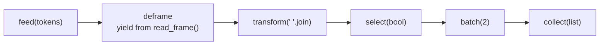

# Python coroutines

What can generator-based coroutines (`send`, `throw`, `close`) do, how do they
compose into pipelines, and where do they stop being the right tool compared
with asyncio, threads or processes? Four small demos answer that, and every
claim below is backed by a test.

## Concept

A generator becomes a coroutine when `yield` is used as an expression:
`value = yield`. The caller drives it with three methods added in PEP 342:

| Call | Inside the generator | What the caller gets back |
|---|---|---|
| `next(gen)` | runs to the first `yield` (priming) | the yielded value |
| `gen.send(x)` | the paused `yield` evaluates to `x`, runs to the next `yield` | the next yielded value, or `StopIteration` if it returned |
| `gen.throw(exc)` | the paused `yield` raises `exc` | the next yielded value if it handled `exc`; otherwise `exc` propagates |
| `gen.close()` | the paused `yield` raises `GeneratorExit` | nothing once it exits; `RuntimeError` if it yields again |

The mechanics that matter:

- **Priming.** A new generator has not run any of its body, so `send(x)` with
  anything but `None` raises `TypeError: can't send non-None value to a
  just-started generator`. `prime.coroutine` calls `next()` once for you.
  Argument checks placed before the first `yield` then fail at construction,
  not on the first `send()`.
- **States.** `inspect.getgeneratorstate()` reports `GEN_CREATED`,
  `GEN_SUSPENDED`, `GEN_RUNNING` or `GEN_CLOSED`. A generator that returned
  or raised is closed for good. It cannot be restarted, only replaced.
- **`GeneratorExit`.** `close()` raises it at the paused `yield`. Cleanup
  belongs in `finally`. A generator cannot close itself while it is running
  (`ValueError: generator already executing`).
- **Return values.** `return x` in a generator raises `StopIteration(x)`, and
  the caller reads `exc.value`. On Python 3.13+ `close()` also returns that
  value if the generator returns while handling `GeneratorExit`.
- **`yield from`** (PEP 380) forwards `send`, `throw` and `close` into a
  subgenerator and evaluates to its return value. It primes the subgenerator
  itself, so never pre-prime one you delegate to.
- **PEP 479.** A `StopIteration` that escapes a generator becomes
  `RuntimeError`. A stage that sends to a downstream that has finished must
  catch the `StopIteration` from that `send()`; `prime.forward` does.

**This is not concurrency.** `send()` is a function call. Nothing runs in
parallel, and nothing runs "while a coroutine waits": a coroutine only
waits because its caller stopped sending. asyncio is built from the same
parts. An event-loop `Task` drives each `async def` coroutine with
`coro.send(None)` and cancels it with `coro.throw(CancelledError)`, and
`await` delegates the way `yield from` does. What asyncio adds is the event
loop, which knows which coroutine to resume when its I/O is ready.
Generator-based asyncio coroutines (`@asyncio.coroutine` with `yield from`)
were deprecated in 3.8 and removed in 3.11; write `async def` instead. Another
everyday user of `throw()` is `contextlib.contextmanager`, which throws the
`with` block's exception into your generator.

## Design

| File | Was | Shows |
|---|---|---|
| `prime.py` | new | `@coroutine` priming decorator; `forward()` for PEP 479-safe sends |
| `basic.py` | `basic.py` | priming, states, what `send()` returns, `close()`, `throw()` |
| `pipeline.py` | `chained.py` | a push pipeline: close propagation, `yield from`, `throw(Flush())`, early stop |
| `dispatcher.py` | `mind-blowing.py` | a parent fanning out to N workers, timed against an asyncio pool |
| `pubsub.py` | `pub-sub.py` | a topic broker whose subscribers are coroutines |

The hyphenated files were renamed because they could not be imported by tests.



Ownership and shutdown follow the same four rules in every demo:

1. **Whoever holds a coroutine owns it and closes it.** Pipeline stages own
   their downstream `target`, the dispatcher's parent owns its workers, and
   the broker owns its subscribers.
2. **Shutdown is `close()`, never an in-band value.** Each owner closes what it
   owns in `finally`, so a close at the head cascades to the tail.
3. **Nothing closes itself.** That is how the first dispatcher hit
   "generator already executing".
4. **Errors have a home.** A pipeline stage that raises closes its downstream
   normally (so `batch` flushes) and the exception reaches whoever called
   `send()`. Dispatcher workers catch per-job errors and report them in an
   `Outcome`, because an exception that escapes a generator ends it. The
   broker logs and removes a subscriber that raises.

**Dispatcher.** `round_robin` hands each job to the next of N workers. Each
`send(job)` runs one job to completion before returning, so exactly one job is
in flight. `run_async_pool` is the asyncio equivalent: N tasks in a
`TaskGroup` reading a bounded `asyncio.Queue`. Its jobs overlap only while
they are suspended in an `await`.

**Pub/sub.** The broker maps topics to subscriber lists and delivers each
message synchronously, in subscription order. A subscriber that publishes
during delivery has its message queued (FIFO) and delivered after the current
one, never by recursing into a running generator. A per-publish budget
(`max_cascade`, default 1000) stops a republish loop.

## Run

```console
$ make run
python3 basic.py
new generator:          GEN_CREATED
send() before priming:  TypeError: can't send non-None value to a just-started generator
primed grep:            GEN_SUSPENDED
grep matched:           ['line 1 brian', 'line 3 brian', 'line 5 brian']
grep send() returned:   {None}
average send() returned [10.0, 15.0, 30.0]
grep after close():     GEN_CLOSED
send() after close():   StopIteration, it never runs again
unhandled throw():      re-raised to the caller: ValueError('injected')
average after throw():  GEN_CLOSED
python3 pipeline.py
WARNING __main__: dropping truncated frame: got 2 of 3 tokens
tokens:  3 the quick fox 0 2 jumps over 1 the 2 lazy dog 3 cut short
batch 1: ['the quick fox', 'jumps over']
batch 2: ['the', 'lazy dog']
python3 dispatcher.py
8 jobs x 0.05s simulated wait, 4 workers
  generator round-robin   0.432s  jobs/worker {0: 2, 1: 2, 2: 2, 3: 2}
  asyncio, awaiting job   0.102s  waits overlap
  asyncio, blocking job   0.421s  time.sleep stalls the loop
python3 pubsub.py
ERROR __main__: subscriber <generator object buggy at 0x...> raised; removing it
Traceback (most recent call last):
  ...
RuntimeError: simulated bug on message 2
INFO __main__: subscriber <generator object first at 0x...> finished; removing it
  display   temperature 34.0
  display   temperature 28.0
  display   humidity    69.3
  first-2   humidity    69.3
  ...
  temp-mean closed: 3 readings, mean 28.5
```

Results go to stdout and logs to stderr. This sample was captured through a
pipe, where Python buffers stdout but not stderr, so the log lines print
before the results around them. In a terminal they interleave in order.

The dispatcher takes options; the other demos have none:

```console
$ python3 dispatcher.py --jobs 1000 --workers 8 --job-seconds 0.01
$ python3 dispatcher.py --workers 0; echo "exit=$?"
usage: dispatcher.py [-h] [--jobs JOBS] [--workers WORKERS]
                     [--job-seconds JOB_SECONDS]
dispatcher.py: error: argument --workers: must be in 1..1000, got 0
exit=2
```

Ctrl+C exits with 130 and SIGTERM with 143, after every `finally` has run
(measured on a 1000-job run: both exit within about 12 ms of the signal, with
no leftover processes).

| Make variable | Default | Used for |
|---|---|---|
| `PYTHON` | `python3` | demos and tests |
| `RUFF` | `uvx ruff@0.16.10` | lint and format check |
| `MYPY` | `uvx mypy@2.4.0` | strict type check |

**About the timings.** They come from a single illustrative run on an Apple
Silicon Mac with Python 3.14.7: 8 jobs of 50 ms simulated wait on 4 workers.
Expect about 8 x 0.05 = 0.40 s when jobs run one at a time and 8 / 4 x 0.05 =
0.10 s when the waits overlap. The claim itself is proved structurally by
tests, not by timing: the generator pool never has more than one job in
flight, the asyncio pool passes a barrier sized to its worker count, and a
blocking job drops asyncio back to one in flight.

## Test

```console
$ make check          # ruff check, ruff format --check, mypy --strict, tests
$ make test
...
test_zero_workers_bug_pool_creates_requested_workers ... ok
test_reentrant_close_bug_close_closes_each_worker_once ... ok
test_awaiting_jobs_run_concurrently ... ok
test_blocking_jobs_run_one_at_a_time ... ok
test_walrus_never_stops_bug_close_stops_subscribers ... ok
...
Ran 83 tests in 0.44s

OK
```

The suite is standard-library `unittest`, needs no network, and takes under a
second. Tests named `*_bug_*` reproduce a bug from the first version.

## Failure modes

| Failure mode | What happens | How it's handled | Test |
|---|---|---|---|
| `send()` to an unprimed generator | `TypeError` | `@coroutine` primes; the broker rejects unprimed subscribers in `subscribe()` | `test_unprimed_generator_rejects_non_none_send`, `test_rejects_unprimed_finished_and_duplicate_subscribers` |
| Generator returns before its first `yield` | a bare `StopIteration` at construction | `RuntimeError` naming the function | `test_generator_that_returns_before_yield_gets_clear_error` |
| Bad constructor argument (`batch(0)`, `take(-1)`, pool size 0) | nonsense behaviour later | `ValueError` at construction, and the stage closes the target it was handed | `test_invalid_batch_size_fails_fast_and_closes_target`, `test_negative_take_limit_fails_fast_and_closes_target`, `test_invalid_pool_sizes_are_rejected` |
| Malformed or negative frame header | parse error mid-stream | `FrameError` propagates out of `feed()`; every stage closes and downstream flushes | `test_malformed_header_raises_and_closes_every_stage`, `test_negative_frame_length_is_rejected` |
| Stream ends mid-frame | incomplete data | the partial frame is dropped with a warning | `test_truncated_final_frame_is_dropped_with_warning` |
| The source raises mid-stream | `feed()` is interrupted | `feed()` closes the head in `finally`; every stage closes and downstream flushes; the error propagates | `test_source_crash_closes_every_stage_and_propagates` |
| A stage raises | that stage is finished | `finally` closes downstream; the exception reaches the caller | `test_stage_exception_closes_downstream_and_propagates` |
| Downstream finishes early | `StopIteration`, which PEP 479 turns into `RuntimeError` | `forward()` returns `False`; the stage returns; upstream stops pulling | `test_finished_downstream_stops_upstream_without_pep479_error`, `test_take_stops_upstream_pulling_from_infinite_source` |
| Stream ends with a partial batch | the last items would be lost | `close()` flushes it | `test_close_flushes_partial_batch` |
| Unhandled `throw()` into a stage | the stage ends | the exception propagates out of `throw()`; downstream closes; the partial batch is discarded (a crash is not a close) | `test_unhandled_throw_propagates_and_closes_downstream` |
| Pre-primed subgenerator under `yield from` | re-primed with `None` as its first value | documented on `read_frame`; the test pins the resulting `TypeError` | `test_preprimed_subgenerator_breaks_yield_from` |
| A job raises inside a worker | would end the worker's generator | caught per job, reported in its `Outcome`; the worker keeps serving | `test_job_error_is_reported_and_worker_keeps_serving` |
| The outcome handler raises | the worker ends | the exception reaches the caller; the parent closes every worker | `test_outcome_handler_error_propagates_and_closes_workers` |
| A worker is closed by someone else | `StopIteration` on the next job | `RuntimeError` naming the worker | `test_externally_closed_worker_raises_clear_error` |
| Closing the dispatcher | the first version re-entered `close()` | the parent closes only its children, exactly once; `close()` is idempotent | `test_reentrant_close_bug_close_closes_each_worker_once` |
| Blocking call inside an asyncio job | stalls the event loop | documented; the test proves one job in flight | `test_blocking_jobs_run_one_at_a_time` |
| The job source crashes mid-run (asyncio) | could strand worker tasks | the `TaskGroup` cancels them and raises an `ExceptionGroup`; no hang | `test_producer_crash_cancels_workers_and_surfaces_error` |
| Unbounded queue | `asyncio.Queue(maxsize=0)` means unbounded | `queue_size >= 1` is enforced, so jobs are pulled lazily | `test_bounded_queue_pulls_jobs_lazily`, `test_invalid_sizes_are_rejected` |
| Invalid CLI flags (0, negative, `nan`, `inf`, too large, not a number) | could run forever or crash | argparse error, exit status 2 | `test_invalid_arguments_exit_with_usage_error` |
| Ctrl+C or SIGTERM mid-run | interrupted | `finally` blocks run; exit 130 or 143; previous SIGTERM handler restored | `test_sigint_mid_run_exits_130`, `test_sigterm_mid_run_exits_143` |
| A subscriber raises | its generator is finished | logged with traceback and removed; never retried; others keep receiving | `test_raising_subscriber_is_removed_and_others_still_receive` |
| A subscriber returns | `StopIteration` | removed quietly (INFO log) | `test_finished_subscriber_is_removed_quietly` |
| A subscriber publishes during delivery | recursion into a running generator | queued FIFO and delivered after the current message | `test_publish_from_subscriber_is_queued_in_order` |
| A subscriber republishes in a loop | endless loop; one message at a time never fills a queue | per-publish cascade budget raises `BrokerOverflowError` in the subscriber, which is removed | `test_runaway_republish_loop_is_bounded_and_removed` |
| A subscriber unsubscribes itself, or closes the broker, mid-delivery | would close a running generator | `RuntimeError` with an explanation; the broker stays consistent | `test_subscriber_unsubscribing_itself_is_refused`, `test_closing_broker_from_inside_subscriber_is_refused` |
| A subscriber's cleanup raises during `close()` | could skip the rest | logged; the other subscribers are still closed | `test_failing_cleanup_does_not_stop_other_closes` |
| Use after `close()` | | `BrokerClosedError` | `test_use_after_close_raises` |
| An exception inside `with Broker()` | | `__exit__` still closes every subscriber | `test_context_manager_closes_when_block_raises` |

## What the first version got wrong

**`basic.py`: `line = yield str`.** The expression after `yield` is what the
coroutine sends *back*, so every `send()` returned the built-in `str` type. A
sink coroutine uses a bare `yield`. Lesson: `yield x` sends `x` out, and the
value of the `yield` expression is what came in.

**`chained.py` was not a chain.** It was one coroutine.
- It ran `main()` on import.
- It slept before every `yield`, so priming took a second and the demo took
  100.
- It raised `StopIteration` at construction unless `_running` had been set
  first: an order-dependent API, made worse by a decorator that leaked the
  bare `StopIteration`.

Lesson: a pipeline is a set of coroutines that send to each other, and
construction must not depend on flags set afterwards.

**`mind-blowing.py` had four bugs and one misconception.**
1. It set `self._worker_count = 0` right before
   `range(self._worker_count)`. No workers were created, and `Parent(5)`
   crashed with `StopIteration`.
2. It popped workers off the list and never put them back, so the pool shrank
   with every job.
3. Its `continue` could skip the `yield`, so `next()`/`send()` would spin
   forever.
4. Its `_stop()` called `self.job.close()` from inside `self.job`
   (`ValueError: generator already executing`).

The misconception: an `is_available` flag that could never be false when
checked, because `send()` finishes the job before the parent looks again,
and a docstring calling it "asynchronous". Lesson: coroutines give you
suspension points, not concurrency. Tracking worker availability only means
something with an event loop.

**`pub-sub.py`: `while running := True`.** The walrus runs on every
iteration and resets `running`, so `running = False` did nothing and the
`else:` cleanup could never run. The intended stop signal was a falsy
message, so payloads such as `0`, `""` or `[]` would have stopped it if it
had worked. The producer slept a second for each of 1,000,000 items, about
11.6 days. Lesson: a condition in `while` is re-evaluated each pass. Stop
coroutines with `close()`, never with in-band sentinel values, and keep
demos bounded.

## When to use what

| Tool | Use it for | Avoid it for |
|---|---|---|
| Generator coroutines | in-process push pipelines, incremental (sans-I/O) parsers, state machines, streams you want to stop early | anything that waits on I/O or needs work to overlap |
| asyncio | many concurrent waits (sockets, HTTP, subprocesses) in one thread, with async libraries all the way down | blocking libraries (wrap them in `asyncio.to_thread`), CPU-bound work |
| Threads | blocking I/O through libraries that have no async API; C extensions that release the GIL | CPU-bound pure Python on the default (GIL) build |
| Processes | CPU-bound pure Python | unpicklable objects and chatty, fine-grained messaging (see `../Piper`) |

## Trade-offs and limits

- **Synchronous delivery.** One slow stage or subscriber slows everything
  behind it, and nothing can time out a `send()` that is in progress.
- **No buffering.** A push pipeline needs no backpressure because `send()`
  cannot outrun the stages, which also means it cannot absorb a bursty
  producer.
- **Payloads are shared, not copied.** The broker passes payloads by
  reference, so a subscriber that mutates one changes it for everyone.
  Publish immutable values or copy.
- **In-process and in-memory.** No persistence and no delivery guarantees
  across a crash; everything in flight is lost. For that, see the RabbitMQ
  prototype in `../pub-sub`.
- **Single-run timings.** The dispatcher numbers are illustrative. The
  structural tests are the evidence.
- **Not covered.** Async generators (`async def` with `yield`,
  `asend`/`athrow`/`aclose`), and structured-concurrency libraries such as
  Trio and AnyIO.
- **Next step.** Rebuild `pipeline.py` with async generators and an
  `asyncio.Queue` between stages, to show buffering and backpressure across
  `await` points.
