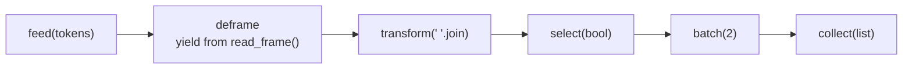
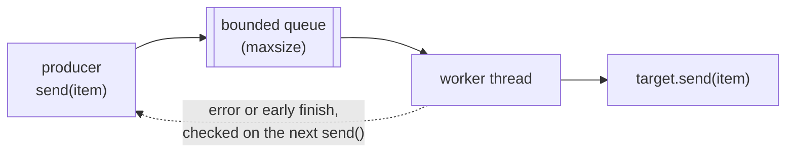

# Python coroutines

What can generator-based coroutines (`send`, `throw`, `close`) do, how do they
compose into pipelines, and where do they stop being the right tool compared
with asyncio, threads or processes? Five small demos answer that, and every
claim below is backed by a test or a reproducible `make run`.

## Concept

A generator becomes a coroutine when `yield` is used as an expression:
`value = yield`. The caller drives it with three methods added in PEP 342:

| Call | Inside the generator | What the caller gets back |
|---|---|---|
| `next(gen)` | runs to the first `yield` (priming) | the yielded value |
| `gen.send(x)` | the paused `yield` evaluates to `x`, runs to the next `yield` | the next yielded value, or `StopIteration` if it returned |
| `gen.throw(exc)` | the paused `yield` raises `exc` | the next yielded value if it handled `exc`; otherwise `exc` propagates |
| `gen.close()` | the paused `yield` raises `GeneratorExit` | nothing once it exits; `RuntimeError` if it yields again |

The mechanics that matter:

- **Priming.** A new generator has not run any of its body, so `send(x)` with
  anything but `None` raises `TypeError: can't send non-None value to a
  just-started generator`. `prime.coroutine` calls `next()` once for you.
  Argument checks placed before the first `yield` then fail at construction,
  not on the first `send()`.
- **States.** `inspect.getgeneratorstate()` reports `GEN_CREATED`,
  `GEN_SUSPENDED`, `GEN_RUNNING` or `GEN_CLOSED`. A generator that returned
  or raised is closed for good. It cannot be restarted, only replaced.
- **`GeneratorExit`.** `close()` raises it at the paused `yield`. Cleanup
  belongs in `finally`. A generator cannot close itself while it is running
  (`ValueError: generator already executing`).
- **Return values.** `return x` in a generator raises `StopIteration(x)`, and
  the caller reads `exc.value`. On Python 3.13+ `close()` also returns that
  value if the generator returns while handling `GeneratorExit`.
- **`yield from`** (PEP 380) forwards `send`, `throw` and `close` into a
  subgenerator and evaluates to its return value. It primes the subgenerator
  itself, so never pre-prime one you delegate to.
- **PEP 479.** A `StopIteration` that escapes a generator becomes
  `RuntimeError`. A stage that sends to a downstream that has finished must
  catch the `StopIteration` from that `send()`; `prime.forward` does.

**This is not concurrency.** `send()` is a function call. Nothing runs in
parallel, and nothing runs "while a coroutine waits": a coroutine only
waits because its caller stopped sending. asyncio is built from the same
parts. An event-loop `Task` drives each `async def` coroutine with
`coro.send(None)` and cancels it with `coro.throw(CancelledError)`, and
`await` delegates the way `yield from` does. What asyncio adds is the event
loop, which knows which coroutine to resume when its I/O is ready.
Generator-based asyncio coroutines (`@asyncio.coroutine` with `yield from`)
were deprecated in 3.8 and removed in 3.11; write `async def` instead. Another
everyday user of `throw()` is `contextlib.contextmanager`, which throws the
`with` block's exception into your generator.

**Crossing into a thread.** A coroutine can also hand its values to another
thread. `threaded(target)` is David Beazley's bridge: a coroutine whose
`send()` puts each value on a bounded `queue.Queue`, from which a worker
thread feeds `target`. The producer only waits while the queue is full. What
the thread buys depends on the GIL:
- On the default build only one thread runs Python bytecode at a time. The
  bridge overlaps a target that *blocks* (sleeping, file or socket I/O, C code
  that releases the GIL) with the producer, and gains nothing for a CPU-bound
  target.
- The free-threaded build (PEP 703, optional since 3.13) can run both in
  parallel.

The demo measures both cases and prints which build it is running on.

## Design

| File | Was | Shows |
|---|---|---|
| `prime.py` | new | `@coroutine` priming decorator; `forward()` for PEP 479-safe sends |
| `basic.py` | `basic.py` | priming, states, what `send()` returns, `close()`, `throw()` |
| `pipeline.py` | `chained.py` | a push pipeline: close propagation, `yield from`, `throw(Flush())`, early stop |
| `dispatcher.py` | `mind-blowing.py` | a parent fanning out to N workers, timed against an asyncio pool |
| `pubsub.py` | `pub-sub.py` | a topic broker whose subscribers are coroutines |
| `threaded.py` | `advanced.py` on the `add-python-typing` branch | a coroutine-to-thread bridge: backpressure, error hand-off, clean shutdown |
| `cli.py` | new | argparse validators and signal exit codes shared by the demos |

The hyphenated files were renamed because they could not be imported by tests.
`threaded.py` was imported verbatim from commit `d0e009d`, keeping its
author, and then fixed in the next commit.



Ownership and shutdown follow the same four rules in every demo:

1. **Whoever holds a coroutine owns it and closes it.** Pipeline stages own
   their downstream `target`, the dispatcher's parent owns its workers, the
   broker owns its subscribers, and the threaded bridge owns its target and
   its worker thread.
2. **Shutdown is `close()`, never an in-band value.** Each owner closes what it
   owns in `finally`, so a close at the head cascades to the tail.
3. **Nothing closes itself.** That is how the first dispatcher hit
   "generator already executing".
4. **Errors have a home.** A pipeline stage that raises closes its downstream
   normally (so `batch` flushes) and the exception reaches whoever called
   `send()`. Dispatcher workers catch per-job errors and report them in an
   `Outcome`, because an exception that escapes a generator ends it. The
   broker logs and removes a subscriber that raises. The threaded bridge
   carries a target's exception back to the sender.

**Dispatcher.** `round_robin` hands each job to the next of N workers. Each
`send(job)` runs one job to completion before returning, so exactly one job is
in flight. `run_async_pool` is the asyncio equivalent: N tasks in a
`TaskGroup` reading a bounded `asyncio.Queue`. Its jobs overlap only while
they are suspended in an `await`.

**Pub/sub.** The broker maps topics to subscriber lists and delivers each
message synchronously, in subscription order. A subscriber that publishes
during delivery has its message queued (FIFO) and delivered after the current
one, never by recursing into a running generator. A per-publish budget
(`max_cascade`, default 1000) stops a republish loop.

**Threaded bridge.**



`threaded(target, maxsize=64, name=None)` starts a named worker thread and
returns a primed coroutine. `send()` queues the item and returns, waiting only
while `maxsize` items are already queued. One FIFO queue and one worker keep
items in order. The worker records a target exception or an early finish, and
the sender checks for both before queueing the next item:
- A target exception is re-raised once, with a note naming the thread, and
  the item that triggered the check is not accepted.
- An early finish ends the bridge: `send()` raises `StopIteration`.

After a failure the worker keeps draining and discarding items until it is
told to stop, so the sender never blocks on a full queue that nobody reads.

Shutdown comes in two modes:
- **`close()` drains.** It delivers every accepted item, closes the target on
  the worker thread, and joins.
- **Any other exception thrown in aborts**, Ctrl+C included. The worker stops
  after the item in progress, the backlog is discarded, and the thread is
  joined. A second Ctrl+C during that join aborts too.

`in_thread(target)` is the `with` form: a normal exit closes and an exception
aborts. `feed()` always calls `close()`, so it always drains. The worker also
stops on its own once the main thread has exited, so an unclosed bridge cannot
hang interpreter shutdown.

The bridge is a generator rather than a class so that it plugs into
everything else here: `feed()`, pipeline stages, and the broker, which checks
generator state. The cost is that sending to a finished bridge raises the
protocol's `StopIteration` instead of a custom error. The first `send()` after
a target failure still raises the target's own exception.

## Run

```console
$ make run
python3 basic.py
new generator:          GEN_CREATED
send() before priming:  TypeError: can't send non-None value to a just-started generator
primed grep:            GEN_SUSPENDED
grep matched:           ['line 1 brian', 'line 3 brian', 'line 5 brian']
grep send() returned:   {None}
average send() returned [10.0, 15.0, 30.0]
grep after close():     GEN_CLOSED
send() after close():   StopIteration, it never runs again
unhandled throw():      re-raised to the caller: ValueError('injected')
average after throw():  GEN_CLOSED
python3 pipeline.py
WARNING __main__: dropping truncated frame: got 2 of 3 tokens
tokens:  3 the quick fox 0 2 jumps over 1 the 2 lazy dog 3 cut short
batch 1: ['the quick fox', 'jumps over']
batch 2: ['the', 'lazy dog']
python3 dispatcher.py
8 jobs x 0.05s simulated wait, 4 workers
  generator round-robin   0.432s  jobs/worker {0: 2, 1: 2, 2: 2, 3: 2}
  asyncio, awaiting job   0.102s  waits overlap
  asyncio, blocking job   0.421s  time.sleep stalls the loop
python3 pubsub.py
ERROR __main__: subscriber <generator object buggy at 0x...> raised; removing it
Traceback (most recent call last):
  ...
RuntimeError: simulated bug on message 2
INFO __main__: subscriber <generator object first at 0x...> finished; removing it
  display   temperature 34.0
  display   temperature 28.0
  display   humidity    69.3
  first-2   humidity    69.3
  ...
  temp-mean closed: 3 readings, mean 28.5
python3 threaded.py
8 items, 0.025s to produce and 0.025s to consume each, GIL enabled: True
  blocking target   inline  0.450s  threaded  0.264s  in order: True
  CPU-bound target  inline  0.400s  threaded  0.407s  in order: True
  target error reached the producer: ValueError('cannot handle 3') ["raised by the target in thread 'fragile'"]
  take(3) on the worker stopped an infinite source at [0, 1, 2]
  worker threads still running: 0
```

Results go to stdout and logs to stderr. This sample was captured through a
pipe, where Python buffers stdout but not stderr, so the log lines print
before the results around them. In a terminal they interleave in order.

The dispatcher and the threaded demo take options; the others have none:

```console
$ python3 dispatcher.py --jobs 1000 --workers 8 --job-seconds 0.01
$ python3 threaded.py --items 40 --item-seconds 0.025 --maxsize 4
$ python3 dispatcher.py --workers 0; echo "exit=$?"
usage: dispatcher.py [-h] [--jobs JOBS] [--workers WORKERS]
                     [--job-seconds JOB_SECONDS]
dispatcher.py: error: argument --workers: must be in 1..1000, got 0
exit=2
```

Ctrl+C exits with 130 and SIGTERM with 143, after every `finally` has run.
Measured: a 1000-job dispatcher run exits within about 12 ms of either
signal. A 100-item threaded run exits within 15 to 44 ms, whether the signal
lands in the inline phase or while the bridge is busy; there, the wait is
bounded by the 50 ms item in progress. No processes or threads are left
behind.

| Make variable | Default | Used for |
|---|---|---|
| `PYTHON` | `python3` | demos and tests |
| `RUFF` | `uvx ruff@0.16.10` | lint and format check |
| `MYPY` | `uvx mypy@2.4.0` | strict type check |

**About the timings.** They come from a single illustrative run on an Apple
Silicon Mac with Python 3.14.7: 8 jobs of 50 ms simulated wait on 4 workers.
Expect about 8 x 0.05 = 0.40 s when jobs run one at a time and 8 / 4 x 0.05 =
0.10 s when the waits overlap. The claim itself is proved structurally by
tests, not by timing: the generator pool never has more than one job in
flight, the asyncio pool passes a barrier sized to its worker count, and a
blocking job drops asyncio back to one in flight.

The threaded timings are a single run on the same machine with the default
(GIL) build: 8 items, each taking 25 ms to produce and 25 ms to consume.
- **Inline** costs about 8 x 0.05 = 0.40 s.
- **Blocking target behind the bridge.** The waits overlap, so expect about
  0.025 + 8 x 0.025 = 0.225 s plus overhead (measured 0.264 s).
- **CPU-bound target behind the bridge.** No faster under the GIL (0.407 s).

At 40 items the pattern holds: blocking 2.267 s down to 1.192 s, CPU-bound
2.020 s vs 2.060 s.

CPU work is simulated by spinning on `time.thread_time()`, the thread's own
CPU clock. A first draft of this demo spun on a wall clock and showed a fake
40% CPU-bound speed-up: the deadline kept running while the thread waited for
the GIL.

## Test

```console
$ make check          # ruff check, ruff format --check, mypy --strict, tests
$ make test
...
test_zero_workers_bug_pool_creates_requested_workers ... ok
test_reentrant_close_bug_close_closes_each_worker_once ... ok
test_awaiting_jobs_run_concurrently ... ok
test_blocking_jobs_run_one_at_a_time ... ok
test_walrus_never_stops_bug_close_stops_subscribers ... ok
test_sentinel_as_class_bug_generator_exit_is_just_data ... ok
test_never_joined_thread_bug_unclosed_bridge_does_not_hang_exit ... ok
test_silent_target_death_bug_error_reaches_sender_on_send ... ok
...
Ran 117 tests in 0.56s

OK
```

The suite is standard-library `unittest`, needs no network, and takes under a
second. Tests named `*_bug_*` reproduce a bug from the first version.

The threaded tests make no wall-clock assertions. They synchronise on events
raised by the code under test, and on an instrumented queue that records its
peak depth and every put that found it full; `Queue.join()` waits until the
worker has handled an item. Every test checks that it left no threads behind.
A per-test `faulthandler` watchdog turns a deadlock into a failed run with
every thread's traceback, because a `join()` that never returns cannot be
timed out from inside the code under test.

## Failure modes

| Failure mode | What happens | How it's handled | Test |
|---|---|---|---|
| `send()` to an unprimed generator | `TypeError` | `@coroutine` primes; the broker rejects unprimed subscribers in `subscribe()` | `test_unprimed_generator_rejects_non_none_send`, `test_rejects_unprimed_finished_and_duplicate_subscribers` |
| Generator returns before its first `yield` | a bare `StopIteration` at construction | `RuntimeError` naming the function | `test_generator_that_returns_before_yield_gets_clear_error` |
| Bad constructor argument (`batch(0)`, `take(-1)`, pool size 0) | nonsense behaviour later | `ValueError` at construction, and the stage closes the target it was handed | `test_invalid_batch_size_fails_fast_and_closes_target`, `test_negative_take_limit_fails_fast_and_closes_target`, `test_invalid_pool_sizes_are_rejected` |
| Malformed or negative frame header | parse error mid-stream | `FrameError` propagates out of `feed()`; every stage closes and downstream flushes | `test_malformed_header_raises_and_closes_every_stage`, `test_negative_frame_length_is_rejected` |
| Stream ends mid-frame | incomplete data | the partial frame is dropped with a warning | `test_truncated_final_frame_is_dropped_with_warning` |
| The source raises mid-stream | `feed()` is interrupted | `feed()` closes the head in `finally`; every stage closes and downstream flushes; the error propagates | `test_source_crash_closes_every_stage_and_propagates` |
| A stage raises | that stage is finished | `finally` closes downstream; the exception reaches the caller | `test_stage_exception_closes_downstream_and_propagates` |
| Downstream finishes early | `StopIteration`, which PEP 479 turns into `RuntimeError` | `forward()` returns `False`; the stage returns; upstream stops pulling | `test_finished_downstream_stops_upstream_without_pep479_error`, `test_take_stops_upstream_pulling_from_infinite_source` |
| Stream ends with a partial batch | the last items would be lost | `close()` flushes it | `test_close_flushes_partial_batch` |
| Unhandled `throw()` into a stage | the stage ends | the exception propagates out of `throw()`; downstream closes; the partial batch is discarded (a crash is not a close) | `test_unhandled_throw_propagates_and_closes_downstream` |
| Pre-primed subgenerator under `yield from` | re-primed with `None` as its first value | documented on `read_frame`; the test pins the resulting `TypeError` | `test_preprimed_subgenerator_breaks_yield_from` |
| A job raises inside a worker | would end the worker's generator | caught per job, reported in its `Outcome`; the worker keeps serving | `test_job_error_is_reported_and_worker_keeps_serving` |
| The outcome handler raises | the worker ends | the exception reaches the caller; the parent closes every worker | `test_outcome_handler_error_propagates_and_closes_workers` |
| A worker is closed by someone else | `StopIteration` on the next job | `RuntimeError` naming the worker | `test_externally_closed_worker_raises_clear_error` |
| Closing the dispatcher | the first version re-entered `close()` | the parent closes only its children, exactly once; `close()` is idempotent | `test_reentrant_close_bug_close_closes_each_worker_once` |
| Blocking call inside an asyncio job | stalls the event loop | documented; the test proves one job in flight | `test_blocking_jobs_run_one_at_a_time` |
| The job source crashes mid-run (asyncio) | could strand worker tasks | the `TaskGroup` cancels them and raises an `ExceptionGroup`; no hang | `test_producer_crash_cancels_workers_and_surfaces_error` |
| Unbounded queue | `asyncio.Queue(maxsize=0)` means unbounded | `queue_size >= 1` is enforced, so jobs are pulled lazily | `test_bounded_queue_pulls_jobs_lazily`, `test_invalid_sizes_are_rejected` |
| Invalid CLI flags (0, negative, `nan`, `inf`, too large, not a number) | could run forever or crash | argparse error, exit status 2 (dispatcher and threaded demos) | `test_invalid_arguments_exit_with_usage_error`, `test_rejects_out_of_range_and_non_integers`, `test_rejects_negative_infinite_nan_and_too_large` |
| Ctrl+C or SIGTERM mid-run | interrupted | `finally` blocks run; exit 130 or 143; previous SIGTERM handler restored | `test_sigint_mid_run_exits_130`, `test_sigterm_mid_run_exits_143`, `test_sigterm_returns_143_and_restores_handler` |
| A subscriber raises | its generator is finished | logged with traceback and removed; never retried; others keep receiving | `test_raising_subscriber_is_removed_and_others_still_receive` |
| A subscriber returns | `StopIteration` | removed quietly (INFO log) | `test_finished_subscriber_is_removed_quietly` |
| A subscriber publishes during delivery | recursion into a running generator | queued FIFO and delivered after the current message | `test_publish_from_subscriber_is_queued_in_order` |
| A subscriber republishes in a loop | endless loop; one message at a time never fills a queue | per-publish cascade budget raises `BrokerOverflowError` in the subscriber, which is removed | `test_runaway_republish_loop_is_bounded_and_removed` |
| A subscriber unsubscribes itself, or closes the broker, mid-delivery | would close a running generator | `RuntimeError` with an explanation; the broker stays consistent | `test_subscriber_unsubscribing_itself_is_refused`, `test_closing_broker_from_inside_subscriber_is_refused` |
| A subscriber's cleanup raises during `close()` | could skip the rest | logged; the other subscribers are still closed | `test_failing_cleanup_does_not_stop_other_closes` |
| Use after `close()` | | `BrokerClosedError` | `test_use_after_close_raises` |
| An exception inside `with Broker()` | | `__exit__` still closes every subscriber | `test_context_manager_closes_when_block_raises` |
| Producer outpaces a slow threaded target | memory grows without limit (first version: unbounded queue) | bounded queue: `send()` waits while `maxsize` items are queued | `test_queue_depth_never_exceeds_maxsize` |
| Items reordered across the thread hop | | one FIFO queue and one worker | `test_items_arrive_in_order`, `test_ctrl_c_during_a_run_aborts_and_joins` |
| The old stop value (`GeneratorExit`) or `None` is sent as data | first version stopped delivering and dropped later items | a private enum member ends the stream; every user value is data | `test_sentinel_as_class_bug_generator_exit_is_just_data` |
| `close()` on the bridge | first version returned while its thread still ran | delivers the backlog, closes the target on the worker, joins | `test_never_joined_thread_bug_close_joins_worker`, `test_close_delivers_the_backlog_first`, `test_target_is_closed_on_the_worker_thread` |
| Bridge never closed, held in a module global | first version hung interpreter exit | the worker notices the main thread has exited, delivers what is queued, closes the target and exits | `test_never_joined_thread_bug_unclosed_bridge_does_not_hang_exit` |
| Bridge dropped without `close()` | | the generator's finaliser runs `close()`: drained and joined | `test_unreferenced_bridge_is_joined_by_garbage_collection` |
| The threaded target raises | first version: worker died silently and the sender kept queueing | re-raised once on the next `send()` (that item is not accepted) or by `close()`, with a note naming the thread | `test_silent_target_death_bug_error_reaches_sender_on_send`, `test_error_on_last_item_is_raised_by_close`, `test_error_reaches_in_thread_caller` |
| The threaded target's cleanup raises | | raised by `close()` | `test_error_in_target_cleanup_is_raised_by_close` |
| The target fails while another exception unwinds the bridge | one of the two would be lost | the propagating exception wins; the target's is logged with its traceback | `test_error_during_abort_is_logged_not_lost` |
| The threaded target finishes early | | the next `send()` raises `StopIteration`; `feed()` stops pulling the source | `test_target_finishing_early_stops_an_infinite_source`, `test_send_after_target_finished_raises_stop_iteration` |
| `send()` after `close()`, or after the error was reported | | `StopIteration`, like every finished coroutine | `test_close_is_idempotent_and_send_after_close_stops`, `test_silent_target_death_bug_error_reaches_sender_on_send` |
| Exception or Ctrl+C in the producer while the bridge has a backlog | | abort: the backlog is discarded and the thread joined after its current item; the exception continues | `test_exception_in_with_block_discards_backlog`, `test_ctrl_c_during_a_run_aborts_and_joins` |
| The target sends to or closes its own bridge | the worker would wait on itself forever | `RuntimeError` in the target, an error log, and the worker stops | `test_target_using_its_own_bridge_is_stopped_with_an_error` |
| Bad `maxsize`, or an unprimed or finished target | | `ValueError`; the target is closed | `test_invalid_arguments_are_rejected_and_target_closed` |
| A deadlock inside a threaded test | would hang the test run | per-test `faulthandler` watchdog fails the run with every thread's traceback | every test in `test_threaded.py` |

## What the first version got wrong

**`basic.py`: `line = yield str`.** The expression after `yield` is what the
coroutine sends *back*, so every `send()` returned the built-in `str` type. A
sink coroutine uses a bare `yield`. Lesson: `yield x` sends `x` out, and the
value of the `yield` expression is what came in.

**`chained.py` was not a chain.** It was one coroutine.
- It ran `main()` on import.
- It slept before every `yield`, so priming took a second and the demo took
  100.
- It raised `StopIteration` at construction unless `_running` had been set
  first: an order-dependent API, made worse by a decorator that leaked the
  bare `StopIteration`.

Lesson: a pipeline is a set of coroutines that send to each other, and
construction must not depend on flags set afterwards.

**`mind-blowing.py` had four bugs and one misconception.**
1. It set `self._worker_count = 0` right before
   `range(self._worker_count)`. No workers were created, and `Parent(5)`
   crashed with `StopIteration`.
2. It popped workers off the list and never put them back, so the pool shrank
   with every job.
3. Its `continue` could skip the `yield`, so `next()`/`send()` would spin
   forever.
4. Its `_stop()` called `self.job.close()` from inside `self.job`
   (`ValueError: generator already executing`).

The misconception: an `is_available` flag that could never be false when
checked, because `send()` finishes the job before the parent looks again,
and a docstring calling it "asynchronous". Lesson: coroutines give you
suspension points, not concurrency. Tracking worker availability only means
something with an event loop.

**`pub-sub.py`: `while running := True`.** The walrus runs on every
iteration and resets `running`, so `running = False` did nothing and the
`else:` cleanup could never run. The intended stop signal was a falsy
message, so payloads such as `0`, `""` or `[]` would have stopped it if it
had worked. The producer slept a second for each of 1,000,000 items, about
11.6 days. Lesson: a condition in `while` is re-evaluated each pass. Stop
coroutines with `close()`, never with in-band sentinel values, and keep
demos bounded.

**`advanced.py`, the threaded PoC on `add-python-typing` (`d0e009d`).** Each
of the first three bugs below was reproduced against the original file before
it was fixed.
- **The `GeneratorExit` class doubled as the stop value.** It was compared
  with `==`, and the demo itself stopped the thread by *sending* the class as
  data. Any caller that sent it ended delivery, and later items were silently
  dropped: sending `[1, GeneratorExit, 2, 3]` delivered only `[1]`. Lesson: a
  sentinel must be a private object no caller can produce, and stopping is
  better done through a channel separate from the data.
- **The thread was never joined.** `Thread(...).start()` kept no handle, so
  nothing could join it. `close()` returned while the thread still ran, and a
  bridge that was never closed hung the interpreter at exit: the reproduction
  had to be killed after 5 s. A non-daemon thread is the right choice, but only
  if someone joins it. Lesson: whoever starts a thread owns its `join()`.
- **A target exception killed the worker thread silently.** The traceback
  went to stderr through `threading.excepthook`, the program exited 0, and the
  sender, never told, kept queueing into a queue nobody read. Lesson: an error
  in a thread must be handed to someone who can act on it, the way
  `concurrent.futures.Future.result()` does.
- **`Queue()` was unbounded.** A fast producer and a slow target meant
  unbounded memory.
- **It caught `KeyboardInterrupt` inside the generator.** That can only
  arrive there if thrown in, and catching it then returning would swallow
  Ctrl+C.
- **Smaller issues.** `ThreadObject.handle_shit`, unseeded random demo data, a
  four-quote docstring (`""""`), an unused `sleep` import, and
  `from pub_sub import coroutine` tying the PoC to a renamed demo module.

**That branch's typing changes, superseded here.**
- **`Generator[Type[str], Any, None]` annotated the bug instead of fixing
  it.** The coroutine yielded the `str` *type*, and the annotation made that
  official, while `line: str = yield str` claimed `str` came in even though the
  signature said `Any`. Lesson: when an annotation is awkward to write, the
  code is usually wrong. `basic.grep` is `Generator[None, str, None]`: it
  yields nothing and receives `str`.
- **Bare `Generator` documents nothing.** `rtn: Generator` and
  `self.job: typing.Generator` mean `Generator[Any, Any, Any]`, which accepts
  anything; `mypy --strict` rejects them. `typing.List[Child]` has been
  deprecated in favour of `list[Child]` since 3.9 (PEP 585), and
  `collections.abc.Generator` is the non-deprecated spelling of `Generator`.
- **Only one file was renamed.** `pub-sub.py` became `pub_sub.py` so it could
  be imported, but by replacing its `if __name__ == "__main__": main()` with a
  commented-out `# main()`, so the demo no longer ran. `mind-blowing.py` kept
  its hyphen and stayed unimportable. Here every module has an importable name
  and still runs through `main()` under a `__main__` guard.
- **No type checker ran.** None of those annotations would have caught a
  runtime bug above. Here `mypy --strict` is part of `make check`.

## When to use what

| Tool | Use it for | Avoid it for |
|---|---|---|
| Generator coroutines | in-process push pipelines, incremental (sans-I/O) parsers, state machines, streams you want to stop early | anything that waits on I/O or needs work to overlap |
| asyncio | many concurrent waits (sockets, HTTP, subprocesses) in one thread, with async libraries all the way down | blocking libraries (wrap them in `asyncio.to_thread`), CPU-bound work |
| Threads (e.g. `threaded()` behind a pipeline) | blocking I/O through libraries that have no async API; C extensions that release the GIL | CPU-bound pure Python on the default (GIL) build |
| Processes | CPU-bound pure Python | unpicklable objects and chatty, fine-grained messaging (see `../Piper`) |

## Trade-offs and limits

- **Synchronous delivery.** One slow stage or subscriber slows everything
  behind it, and nothing can time out a `send()` that is in progress.
- **No buffering.** A push pipeline needs no backpressure because `send()`
  cannot outrun the stages, which also means it cannot absorb a bursty
  producer.
- **Payloads are shared, not copied.** The broker passes payloads by
  reference, so a subscriber that mutates one changes it for everyone.
  Publish immutable values or copy.
- **In-process and in-memory.** No persistence and no delivery guarantees
  across a crash; everything in flight is lost. For that, see the RabbitMQ
  prototype in `../pub-sub`.
- **Threads cannot be killed.** Both `close()` and an abort wait for the
  item in progress. A target that blocks forever blocks shutdown, so blocking
  calls inside a target need their own timeouts.
- **One sender per bridge.** A generator cannot be resumed from two threads
  at once ("generator already executing"). Nothing but the worker may touch
  the target once it has been handed over.
- **Liveness checks poll.** A side that is waiting re-checks every 50 ms
  whether the other side still exists. That bounds how quickly an abandoned
  bridge or a dead worker is noticed, but never delays an item.
- **Shutdown detection relies on interpreter behaviour.** The unclosed-bridge
  safeguard depends on the interpreter stopping the main thread before it
  joins the others. That was verified on CPython 3.14, not on the
  free-threaded build.
- **Single-run timings.** The dispatcher and threaded numbers are
  illustrative. The structural tests are the evidence; the GIL comparison is
  reproducible with `make run`.
- **Not covered.** Async generators (`async def` with `yield`,
  `asend`/`athrow`/`aclose`), and structured-concurrency libraries such as
  Trio and AnyIO.
- **Next step.** Rebuild `pipeline.py` with async generators and an
  `asyncio.Queue` between stages, to show buffering and backpressure across
  `await` points.
