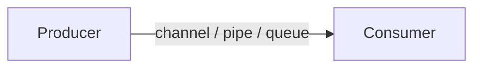

# <Prototype name>

<!-- One paragraph. Open with the question, then say in one sentence what the
prototype shows. Example: "How do I fan work out from several producer processes
to one consumer over OS pipes, and what can cross a process boundary? This
prototype shows ..." -->

## Concept

<!-- Teach the idea correctly and concisely: the mechanics a reader must
understand to follow the code. Link primary sources (language docs, papers,
the AWS Builders' Library, the Google SRE book) rather than restating them. -->

## Design



<!-- Components and data flow. For every process, thread, goroutine, connection
and file: who owns it, and how it shuts down (normal finish, SIGINT/SIGTERM,
component failure). -->

## Run

```console
$ make run
<real output, abbreviated>
```

| Variable | Default | Meaning |
|---|---|---|
| `EXAMPLE` | `2` | <what it controls> |

## Test

```console
$ make check
<real output, abbreviated>
```

## Failure modes

| Failure mode | What happens | How it's handled | Test |
|---|---|---|---|
| <e.g. producer crashes mid-stream> | <observable effect> | <mechanism> | `test_name` |

## What the first version got wrong

<!-- Each original bug or misconception: what it was, why it happened, and the
lesson. Omit this section for a brand-new prototype. -->

## Trade-offs and limits

<!-- What this design does not prove, when you would not use it, and what you
would do next. -->
