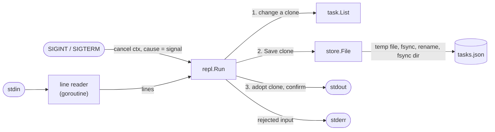

# todo-cli

How do you structure a small Go command-line program so that it is easy to
test and hard to break? This prototype is an interactive todo list. The domain
logic is pure, all I/O sits at the edges, every change is persisted, and the
program behaves sensibly on every input, including no input at all.

## Concept

Four ideas carry the design.

**Pure core, I/O at the edges.** The rules (IDs, completion, validation) live
in a package that takes no input, prints nothing, and does not read the clock.
The caller passes `now` in. Everything that touches the outside world (stdin,
stdout, files, signals) wraps around that core in thin layers. Most tests then
need no terminal, no files and no sleeps.

**Identity is not position.** A task's ID comes from a counter that only goes
up. It never changes when other tasks are completed or deleted, and it is never
reused. The first version used the slice index as the ID, so completing task 1
renumbered everything.

**Persist before you confirm.** Each command runs on a copy of the list. The
copy is saved, and only then does the session adopt it and print "Added task
3". If the save fails, the change is discarded and the user is told. What the
user has seen confirmed is always on disk.

**Atomic replace.** A save writes a temporary file in the same directory,
flushes it to disk (`fsync`), renames it over the old file and flushes the
directory. `rename` within one filesystem is atomic, so a crash leaves either
the whole old file or the whole new one, never a mix.

Two Go details matter here:

- A blocking `Read` on a terminal cannot be interrupted. To react to Ctrl+C
  while waiting at a prompt, input is read on its own goroutine and the session
  `select`s between "next line" and "context cancelled".
- Go time layouts are written with the reference time
  `Mon Jan 2 15:04:05 MST 2006`. Each number is a specific field: `01` month,
  `02` day, `15` hour, `04` minute. Any other digits are either a different
  field or literal text.

## Design

```
todo-cli/
├── cmd/todo/         flags, exit codes, signals: the only code that knows about os
├── internal/task/    Task and List: IDs, completion, validation. No I/O, no clock
├── internal/store/   JSON file persistence with atomic replace
└── internal/repl/    the prompt, over io.Reader / io.Writer
```



**Ownership and shutdown.**
- `main` owns the process: it parses flags, loads the file, starts the signal
  watcher and maps the result of `repl.Run` to an exit code.
- `repl.Run` owns the session and the reader goroutine. It returns on `q`, at
  end of input, on cancellation, or when reading input or writing output fails.
- On a signal, the session notices at its next wait for input. A save already
  in progress always completes first.
- After the first signal, default signal handling is restored, so a second
  Ctrl+C terminates at once if shutdown ever hangs. This is by construction
  and not tested: nothing in shutdown can block.
- If the reader goroutine is inside a terminal `Read` when the session ends,
  it exits with the process.

**The `Store` interface** is declared in `repl`, its only consumer, with one
method (`Save`). It exists so tests can substitute a fake. `*store.File`
satisfies it, and there are no other interfaces.

**File format** (version 1). Times are stored in UTC and displayed in local
time. Text is written verbatim, not HTML-escaped. Files are mode 0600 and
created directories 0700.

```json
{
  "version": 1,
  "next_id": 4,
  "tasks": [
    {
      "id": 1,
      "name": "Buy milk",
      "description": "2 litres",
      "created_at": "2026-10-02T15:47:00Z",
      "completed_at": "2026-10-02T16:47:00Z"
    }
  ]
}
```

`next_id` is stored separately from the tasks, so deleting the newest task does
not free its ID for reuse.

## Run

```console
$ make demo        # scripted session against a fresh file; exits on its own
printf 'e\nBuy milk\n2 litres\ne\nWrite README\n\nf\n1\nd\n9\nl\na\nq\n' | bin/todo -file .demo-tasks.json
todo: tasks are saved to /…/todo-cli/.demo-tasks.json
Commands:
  e  add a task
  f  finish (complete) a task
  l  list pending tasks
  a  list all tasks
  d  delete a task
  h  show this help
  q  quit (end of input, Ctrl+D, also quits)
> Name: Description (optional): Added task 1: Buy milk
> Name: Description (optional): Added task 2: Write README
> Task ID to complete: Completed task 1: Buy milk
> Task ID to delete: error: task not found: 9
> ID  NAME          DESCRIPTION  CREATED
2   Write README               2026-10-02 15:13
> ID  STATUS   NAME          DESCRIPTION  CREATED           COMPLETED
1   done     Buy milk      2 litres     2026-10-02 15:13  2026-10-02 15:13
2   pending  Write README               2026-10-02 15:13
>
```

The prompts and answers run together above because piped input is not echoed.
At a terminal, each answer is on its own line.

**Requirements:** any `go` 1.21 or newer on `PATH`, and nothing else.
- `go.mod` declares `go 1.26`, the oldest supported release, and pins
  `toolchain go1.27.1`. Go downloads that toolchain on first use.
- The Makefile exports `GOTOOLCHAIN` from the `toolchain` line, so builds,
  tests and linters all use go1.27.1.
- The linters (staticcheck 2026.2.1, golangci-lint v2.14.0, govulncheck
  v1.8.0) run pinned through `go run`.
- The module has no dependencies, so there is no `go.sum`.

```console
$ make run                      # interactive; saves to ./tasks.json
$ make run DATA_FILE=work.json  # another list
$ go run ./cmd/todo             # uses the per-user default file
$ ./bin/todo -h
Usage: todo [-file path]

An interactive todo list. Type h at the prompt for commands.

  -file path
    	path of the JSON file tasks are saved in (default "/Users/you/Library/Application Support/todo-cli/tasks.json")
```

The default data file is `os.UserConfigDir()/todo-cli/tasks.json`. That is
`~/Library/Application Support` on macOS and `$XDG_CONFIG_HOME` (or
`~/.config`) on Linux, so the same list is found from any directory. `make run`
always passes `-file` and never touches it.

**Exit status:** 0 after `q` or end of input; 1 on a runtime failure
(unreadable or corrupt data file, I/O error); 2 on a usage error; 130 after
SIGINT and 143 after SIGTERM (128 + signal number).

### Make targets and variables

| Target | What it does |
|---|---|
| `make build` | Builds `$(BIN)`. |
| `make run` | Interactive session on `$(DATA_FILE)`. Ends on `q` or Ctrl+D. |
| `make demo` | Scripted session on a fresh `$(DEMO_FILE)`. Exits on its own. |
| `make test` | `go test -race -count=1 ./...` |
| `make lint` | The pinned toolchain's gofmt (`go run cmd/gofmt -l .`), `go vet`, staticcheck, and golangci-lint with the repo-wide v2 `.golangci.yml`. |
| `make check` | `lint` then `test`. This is the gate. It needs no network once the toolchain and linters are cached. |
| `make vulncheck` | govulncheck against the Go vulnerability database. It needs network, so it is not part of `check`. It must report "No vulnerabilities found." |
| `make clean` | Removes `$(BIN)` and `$(DEMO_FILE)`. **Never** deletes `$(DATA_FILE)`. |

| Variable | Default | Meaning |
|---|---|---|
| `GO` | `go` | Go command. Any version from 1.21 up works, because it switches to the pinned toolchain. |
| `STATICCHECK` | `$(GO) run honnef.co/go/tools/cmd/staticcheck@2026.2.1` | staticcheck command. |
| `GOLANGCI_LINT` | `$(GO) run github.com/golangci/golangci-lint/v2/cmd/golangci-lint@v2.14.0` | golangci-lint command (v2 config format). |
| `GOVULNCHECK` | `$(GO) run golang.org/x/vuln/cmd/govulncheck@v1.8.0` | govulncheck command. |
| `BIN` | `bin/todo` | Build output path. |
| `ARGS` | (empty) | Extra flags passed to `todo` by `make run`. |
| `DATA_FILE` | `tasks.json` | Data file used by `make run` (gitignored). |
| `DEMO_FILE` | `.demo-tasks.json` | Data file used by `make demo` (gitignored, recreated each run). |

The Makefile also exports two fixed settings that are not meant to be
overridden:
- `GOWORK=off`: the module is standalone and must not pick up a `go.work`
  from an enclosing directory.
- `GOTOOLCHAIN`: read from the `toolchain` line in `go.mod`.

## Test

```console
$ make check
go vet ./...
go run honnef.co/go/tools/cmd/staticcheck@2026.2.1 ./...
go run github.com/golangci/golangci-lint/v2/cmd/golangci-lint@v2.14.0 run ./...
0 issues.
go test -race -count=1 ./...
ok  	github.com/brayomumo/Psychic-compendium/todo-cli/cmd/todo	2.133s
ok  	github.com/brayomumo/Psychic-compendium/todo-cli/internal/repl	2.985s
ok  	github.com/brayomumo/Psychic-compendium/todo-cli/internal/store	1.714s
ok  	github.com/brayomumo/Psychic-compendium/todo-cli/internal/task	2.510s
$ make vulncheck
go run golang.org/x/vuln/cmd/govulncheck@v1.8.0 ./...
No vulnerabilities found.
```

The test layers mirror the code:
- `task` has table tests for every rule.
- `store` uses real temporary files: round trip, a golden copy of the format,
  permissions, symlinks, injected write failures and twelve kinds of corrupt
  file.
- `repl` runs scripted sessions against an in-memory store with a fixed clock,
  plus cancellation tests synchronised on prompts instead of sleeps.
- `cmd/todo` drives `run()` directly. It also re-executes the test binary as
  the real program, to deliver real SIGINT, SIGTERM and SIGPIPE.

## Failure modes

| Failure mode | What happens | How it's handled | Test |
|---|---|---|---|
| End of input (Ctrl+D, script ends) | Session ends, exit 0 | `readLine` returns `io.EOF`; the loop finishes the prompt line and returns | `TestEOFInfiniteLoopIsFixed`, `TestEndOfInputExitsZero` |
| End of input halfway through a command | Session ends, nothing is changed | A change is applied only after every answer is in | `TestEOFMidPromptAddsNothing` |
| ID that is not a number (`x`, empty, `1.5`, too big for `int`) | Message on stderr, prompt returns | `strconv.Atoi` error reported | `TestRejectedInputKeepsSessionGoing` |
| ID that does not exist (0, negative, out of range) | `error: task not found: N` | `ErrNotFound` from a binary search, no indexing | `TestUnknownIDs`, `TestRejectedInputKeepsSessionGoing` |
| Completing a completed task | `error: task already completed: N`; first time kept | `ErrAlreadyDone` | `TestCompleteTwiceKeepsFirstCompletionTime` |
| Empty name, control characters, text over the limit, invalid UTF-8 | Rejected; for a bad name, before asking for a description | `ValidateName` / `ValidateDescription` on trimmed text | `TestAddRejectsInvalidText`, `TestEmptyNameDoesNotAskForDescription`, `TestValidateNameAgreesWithAdd` |
| Terminal escape sequence typed as a command | Echoed back quoted (`"\x1b[2J"`), not executed by the terminal | `%q` formatting | `TestRejectedInputKeepsSessionGoing/escape_sequence_echoed_safely` |
| Input line longer than 64 KiB | Session ends with an error, exit 1; earlier changes are already saved | `bufio.ErrTooLong` surfaces as an error; memory stays bounded | `TestOverlongLineIsAnError` |
| Save fails (disk full, permissions) | Change discarded and reported; session continues | Clone, save, then adopt | `TestFailedSaveDiscardsChange` |
| Write fails partway through a save | Previous file untouched, temp file removed | Temp file plus rename; cleanup unless the rename succeeded | `TestFailedSaveLeavesPreviousFileIntact`, `TestFailedRenameRemovesTempFile` |
| Crash or power loss during a save | Old file or new file, never a partial one | `fsync` before rename, `fsync` of the directory after | By construction. A killed save can leave a `.tasks.json.tmp-*` file (gitignored, safe to delete) |
| Corrupt data file (truncated, not JSON, unknown field, trailing data, other version, duplicate or invalid IDs, missing timestamps) | Exit 1 before any session starts; file left exactly as it was | Strict decoding plus `task.Restore` invariants; `ErrCorrupt` names the file | `TestLoadRejectsCorruptFileWithoutModifyingIt`, `TestCorruptFileIsReportedAndLeftAlone`, `TestRestore` |
| Data file does not exist yet | Empty list; file and directory created on the first save | `ErrNotExist` means empty | `TestLoadMissingFileIsEmptyList`, `TestSaveCreatesPrivateFileAndDirectory` |
| Data path unreadable (e.g. a directory) | Exit 1 with a read error, not "corrupt" | Read errors and content errors are kept apart | `TestUnreadableFileIsAFailure`, `TestLoadUnreadableFileIsNotReportedAsCorrupt` |
| Data file is a symlink | Target updated, link kept | `filepath.EvalSymlinks` before the rename | `TestSaveFollowsSymlink` |
| SIGINT / SIGTERM at a prompt or halfway through adding | Exit 130 / 143; confirmed changes kept; half-entered task dropped; no temp files | Context cancelled with the signal as cause; saves are never interrupted | `TestSignalShutsDownCleanlyAndKeepsData`, `TestCancelWhileWaitingForInput`, `TestCancellationWinsOverWaitingInput` |
| Output reader goes away (`todo \| head -1`) | Killed by SIGPIPE, like `cat` or `grep`; saved data intact | Go runtime default for stdout | `TestClosedStdoutEndsWithSIGPIPEAndKeepsData` |
| Output writer fails (not stdout) | Session ends with the write error, exit 1 | First write error is recorded and checked after every command | `TestWriteFailureEndsSession` |
| Input read error | Exit 1, `read input: …` | Scanner error surfaced | `TestReadFailureIsAnError` |
| Bad flags, stray arguments, empty `-file` | Exit 2 with a usage message | `flag.ContinueOnError` | `TestUsage` |
| No home directory, so no default file | Exit 2, asks for `-file` | `os.UserConfigDir` error reported | `TestNoDefaultLocationRequiresFileFlag` |
| `next_id` at `MaxInt` (hand-edited file) | Adding is refused; IDs never wrap negative | `ErrIDsExhausted` | `TestAddFailsWhenIDsAreExhausted` |
| Two instances on the same file | The last save wins; the other instance's changes since it loaded are lost | **Not handled.** See trade-offs | — |

## What the first version got wrong

1. **End of input looped forever.** `scanner.Scan()` returns `false` at EOF,
   but the loop ignored it and redrew the menu. `printf 'L\n' | ./todo` printed
   20.6 million lines in 3 seconds. *Lesson: every read can end, so check what
   it returns.*
2. **Bad input crashed the program.** `tasks[n-1]` panicked on an
   out-of-range number. A non-number reached `utils.HandleError`, which called
   `log.Fatal` and ended the whole session over a typo. *Lesson: validate at the
   boundary and report. Only `main` decides to exit.*
3. **The date layout was garbage.** `"2006-02-01 12:59pm"` puts the day before
   the month. `12:59` is not hours and minutes: it reads as month `1`, day `2`,
   a colon, second `5` and a literal `9`. So 15:47:33 on 2 October printed as
   `2026-02-10 102:339pm`. *Lesson: build layouts from
   `Mon Jan 2 15:04:05 MST 2006`, or use `time.DateTime` / `time.DateOnly`,
   and test the rendered string.*
4. **IDs were positions.** Completing a task removed it and appended it to the
   end, so every number the user had just seen changed. Deleting shifted the
   rest. *Lesson: identity must not depend on order.*
5. **"Done" had two sources of truth.** A `Done bool` and a `DateFinished`
   could disagree, and completing a task twice overwrote the first completion
   time. Now `CompletedAt` alone records completion, and completing twice is
   an error.
6. **Copy-paste and debug leftovers.** The delete prompt said "Enter task
   number to mark as complete", and `len(tasks)` was printed after every
   command.
7. **Persistence was only a comment.** Five comments promised a database
   (`// save to database`, `// Save to DB`, `// get all tasks from db`, and
   so on), and none was implemented. `LoadConfig` returned a hardcoded `"connect Url"` and would
   `log.Fatal` without a `.env` file. `db.gobnl` held the Postgres attempt: an
   unterminated SQL string, a hardcoded password, and a `defer db.Close()`
   that closed the connection pool before returning it. *Lesson: put the
   boundary (`Save`) in first, then write implementations behind it.*
8. **Repo hygiene broke the build.**
   - A 1.9 MB linux/amd64 binary was committed, which cannot run on the
     darwin/arm64 machine it was written on.
   - The root `go.work` listed only `go-concurrency`, so every `go` command
     inside `todo-cli` failed with "directory prefix . does not contain
     modules listed in go.work".
   - `go.mod` listed the unused `lib/pq` as a direct dependency, and the
     directly imported `godotenv` and `testify` as indirect.

   *Lesson: run `go mod tidy`, gitignore build outputs, and give independent
   modules no workspace.*
9. **The tests could not reach the bugs.** They covered `AddTask` and
   `newTask`. All the bugs above lived in a loop welded to `os.Stdin`, which no
   test could drive. Moving I/O to the edges is what made the new suite
   possible.

## Trade-offs and limits

- **One process per file.** There is no locking. Two instances that load the
  same file both believe they own it, and the later save silently discards
  the other's changes. A lock file (`flock`) or a database would fix this. It
  was left out to keep the store small, and is the first thing to add if the
  file is ever shared.
- **Each save rewrites the whole file.** The cost is O(n) per change, which is
  fine for thousands of tasks and wrong for millions.
- **Durability is only as good as the filesystem.** On macOS, Go's
  `File.Sync` issues `F_FULLFSYNC`. Network filesystems and some virtualised
  disks acknowledge `fsync` without honouring it.
- **The decoder is strict on purpose.** Unknown fields and other versions are
  rejected rather than guessed at. A future format must bump `version` and
  migrate.
- **Column alignment counts runes.** Wide characters (CJK, emoji) occupy two
  terminal cells, so they misalign columns.
- **Postgres, the original goal, is the next step, but not a drop-in one.**
  `Save(*task.List)` fits whole-document storage like a file. A database store
  should not rewrite every row per change; it wants per-operation methods
  (`AddTask`, `CompleteTask`) inside transactions. At that point the `Store`
  interface in `repl` should grow those methods, and the file store would
  implement them by load, modify, save. The domain package would not change.
